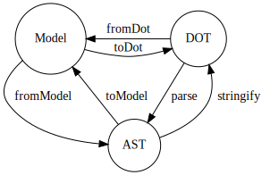

[](https://github.com/kamiazya/ts-graphviz/actions?workflow=NodeCI)
[](https://badge.fury.io/js/ts-graphviz)
[](https://opensource.org/licenses/MIT)
[](http://makeapullrequest.com)
[](https://github.com/facebook/jest)
[](https://github.com/facebook/jest)


[](#contributors)

# ts-graphviz

TypeScriptの ための [Graphviz](https://graphviz.gitlab.io/) ライブラリ

[](https://github.com/ts-graphviz/ts-graphviz)
[](https://www.npmjs.com/package/ts-graphviz)
[](https://github.com/ts-graphviz/ts-graphviz)
[](https://ts-graphviz.github.io/ts-graphviz/)
[](https://github.com/sponsors/kamiazya)

> [English](https://github.com/ts-graphviz/ts-graphviz/blob/main/README.md) | [日本語](https://github.com/ts-graphviz/ts-graphviz/blob/main/README.ja.md)

## 主な機能 ✨

TypeScript に完全に統合された Graphviz DOT言語のモデルとASTを提供します。

- **TypeScript フレンドリーな API**
  - DOT言語のモデルを提供しています。また属性と属性の型まで TypeScript の型定義が用意されています。
- **パラダイムからの開放**
  - オブジェクト指向で設計され、命令的 API と 宣言的 API のどちらにも適合できるAPI提供しています。 プロジェクトにあったパラダイムを選択できます。
- **あらゆるユースケースに対応**
  - モデルを提供する高レイヤーの API と ASTを取り扱う低レイヤーの API をどちらも提供し、あらゆるユースケースに対応します。

## インストール方法 💽

このパッケージは、パッケージマネージャを使用してインストールすることができます。

```bash
# npm
$ npm install -S ts-graphviz
# or yarn
$ yarn add ts-graphviz
# or pnpm
$ pnpm add ts-graphviz
```

## 使い方 📑

この項では、パッケージの概要について説明します。

より詳細なAPIの仕様は、 TypeScript の型定義のコメントやそれを元に自動生成された [ドキュメント](https://ts-graphviz.github.io/ts-graphviz/) を参照してください。

### `ts-graphviz` モジュール 🚩

DOT 言語をJavaScript/TypeScriptで扱うためのインターフェースである Model を提供します。


#### オブジェクト指向 ❤️

**Model** はオブジェクト指向に設計されており、 `Digraph`, `Graph`, `Subgraph`, `Node`, `Edge` のクラスを提供しています。

**Model** を **DOT** (DOT言語の文字列)に変換する`toDot` 関数を提供しています。

```typescript
import { attribute as _, Digraph, Subgraph, Node, Edge, toDot } from 'ts-graphviz';

const G = new Digraph();
const A = new Subgraph('A');
const node1 = new Node('node1', {
  [_.color]: 'red'
});
const node2 = new Node('node2', {
  [_.color]: 'blue'
});
const edge = new Edge([node1, node2], {
  [_.label]: 'Edge Label',
  [_.color]: 'pink'
});
G.addSubgraph(A);
A.addNode(node1);
A.addNode(node2);
A.addEdge(edge);
const dot = toDot(G);
// digraph {
//   subgraph "A" {
//     "node1" [
//       color = "red",
//     ];
//     "node2" [
//       color = "blue",
//     ];
//     "node1" -> "node2" [
//       label = "Edge Label",
//       color = "pink",
//     ];
//   }
// }
```

<details>
<summary>高度な使い方</summary>

クラスを継承することで独自の実装を加えることもできます。

```typescript
import { Digraph, Node, Edge, EdgeTargetTuple, attribute as _, toDot } from 'ts-graphviz';

class MyCustomDigraph extends Digraph {
  constructor() {
    super('G', {
      [_.label]: 'This is Custom Digraph',
    });
  }
}
class MyCustomNode extends Node {
  constructor(id: number) {
    super(`node${id}`, {
      [_.label]: `This is Custom Node ${id}`
    });
  }
}

class MyCustomEdge extends Edge {
  constructor(targets: EdgeTargetTuple) {
    super(targets, {
      [_.label]: 'This is Custom Edge'
    });
  }
}

const digraph = new MyCustomDigraph();
const node1 = new MyCustomNode(1);
const node2 = new MyCustomNode(2);
const edge = new MyCustomEdge([node1, node2]);
digraph.addNode(node1);
digraph.addNode(node2);
digraph.addEdge(edge);
const dot = toDot(g);
// digraph "G" {
//   label = "This is Custom Digraph";
//   "node1" [
//     label = "This is Custom Node 1",
//   ];
//   "node2" [
//     label = "This is Custom Node 2",
//   ];
//   "node1" -> "node2" [
//     label = "This is Custom Edge",
//   ];
// }
```

</details>


#### 宣言的な API 😎

`Graph` や `Digraph` を作成する際に、より **DOT** 言語に近い記法を提供するために _Model Factory_ を使うことができます。

**Model** にも宣言的な API を用意しており、一貫して宣言的なパラダイムを選択することもできます。

```typescript
import { attribute as _, digraph, toDot } from 'ts-graphviz';

 const G = digraph('G', (g) => {
  const a = g.node('aa');
  const b = g.node('bb');
  const c = g.node('cc');
  g.edge([a, b, c], {
    [_.color]: 'red'
  });
  g.subgraph('A', (A) => {
    const Aa = A.node('Aaa', {
      [_.color]: 'pink'
    });

    const Ab = A.node('Abb', {
      [_.color]: 'violet'
    });
    const Ac = A.node('Acc');
    A.edge([Aa.port('a'), Ab, Ac, 'E'], {
      [_.color]: 'red'
    });
  });
});

const dot = toDot(G);
// digraph "G" {
//   "aa";
//   "bb";
//   "cc";
//   subgraph "A" {
//     "Aaa" [
//       color = "pink",
//     ];
//     "Abb" [
//       color = "violet",
//     ];
//     "Acc";
//     "Aaa":"a" -> "Abb" -> "Acc" -> "E" [
//       color = "red",
//     ];
//   }
//   "aa" -> "bb" -> "cc" [
//     color = "red",
//   ];
// }
```

> **Note** もちろん、strictモードのグラフを作るAPIも提供しています。
>
> ```typescript
> import { strict, toDot } from 'ts-graphviz';
>
> const G = strict.graph(...);
> const dot = toDot(G);
> // strict graph {
> // }
> ```

### `ts-graphviz/ast` モジュール 🔢

> このパッケージのステータスは  です。

高度な利用のためにASTを扱うためのAPIを提供しています。



状態遷移図で記載している通り、下記の関数を提供しています。

- **Model** から **AST** に変換する `fromModel` 関数
- **AST** から **DOT** に変換する `stringify` 関数
- **DOT** から **AST** に変換する `parse` 関数

> **Note** 上記の図からわかるように、`ts-graphviz` パッケージで提供している `toDot` 関数は、 `fromModel` と `stringify` の合成関数です。

詳しい利用方法は整備中です。
TypeScriptの型定義を参考にしてください。

<details>
<summary>parse 関数とAST</summary>


```typescript
import { parse } from 'ts-graphviz/ast';

const ast = parse(`
  digraph example {
    node1 [
      label = "My Node",
    ]
  }
`);
// {
//   type: 'Dot',
//   location: {
//     start: { offset: 3, line: 2, column: 3 },
//     end: { offset: 68, line: 7, column: 1 }
//   },
//   children: [
//     {
//       id: {
//         value: 'example',
//         quoted: false,
//         type: 'Literal',
//         location: {
//           start: { offset: 11, line: 2, column: 11 },
//           end: { offset: 18, line: 2, column: 18 }
//         },
//         children: []
//       },
//       directed: true,
//       strict: false,
//       type: 'Graph',
//       location: {
//         start: { offset: 3, line: 2, column: 3 },
//         end: { offset: 67, line: 6, column: 4 }
//       },
//       children: [
//         {
//           id: {
//             value: 'node1',
//             quoted: false,
//             type: 'Literal',
//             location: {
//               start: { offset: 25, line: 3, column: 5 },
//               end: { offset: 30, line: 3, column: 10 }
//             },
//             children: []
//           },
//           type: 'Node',
//           location: {
//             start: { offset: 25, line: 3, column: 5 },
//             end: { offset: 63, line: 5, column: 6 }
//           },
//           children: [
//             {
//               key: {
//                 value: 'label',
//                 quoted: false,
//                 type: 'Literal',
//                 location: {
//                   start: { offset: 39, line: 4, column: 7 },
//                   end: { offset: 44, line: 4, column: 12 }
//                 },
//                 children: []
//               },
//               value: {
//                 value: 'My Node',
//                 quoted: true,
//                 type: 'Literal',
//                 location: {
//                   start: { offset: 47, line: 4, column: 15 },
//                   end: { offset: 56, line: 4, column: 24 }
//                 },
//                 children: []
//               },
//               location: {
//                 start: { offset: 39, line: 4, column: 7 },
//                 end: { offset: 57, line: 4, column: 25 }
//               },
//               type: 'Attribute',
//               children: []
//             }
//           ]
//         }
//       ]
//     }
//   ]
// }
```

</details>

## 関連プロジェクト 💫

関連するプロジェクトは [**ts-graphviz** GitHub Organization](https://github.com/ts-graphviz) で確認することができます。

TypeScript/JavaScript エコシステムで Graphviz との結合度を高め、より使いやすくすることを目的に様々な OSS を提供しています。

## コントリビュータ 👥

この素晴らしい人たち（[emoji key](https://allcontributors.org/docs/en/emoji-key)）に感謝します。

<!-- ALL-CONTRIBUTORS-LIST:START - Do not remove or modify this section -->
<!-- prettier-ignore-start -->
<!-- markdownlint-disable -->
<table>
  <tbody>
    <tr>
      <td align="center"><a href="http://blog.kamiazya.tech/"><br /><sub><b>Yuki Yamazaki</b></sub></a><br /><a href="https://github.com/ts-graphviz/ts-graphviz/commits?author=kamiazya" title="Code">💻</a> <a href="https://github.com/ts-graphviz/ts-graphviz/commits?author=kamiazya" title="Tests">⚠️</a> <a href="https://github.com/ts-graphviz/ts-graphviz/commits?author=kamiazya" title="Documentation">📖</a> <a href="#ideas-kamiazya" title="Ideas, Planning, & Feedback">🤔</a></td>
      <td align="center"><a href="https://laysent.com"><br /><sub><b>LaySent</b></sub></a><br /><a href="https://github.com/ts-graphviz/ts-graphviz/issues?q=author%3Alaysent" title="Bug reports">🐛</a> <a href="https://github.com/ts-graphviz/ts-graphviz/commits?author=laysent" title="Tests">⚠️</a></td>
      <td align="center"><a href="https://github.com/elasticdotventures"><br /><sub><b>elasticdotventures</b></sub></a><br /><a href="https://github.com/ts-graphviz/ts-graphviz/commits?author=elasticdotventures" title="Documentation">📖</a></td>
      <td align="center"><a href="https://github.com/ChristianMurphy"><br /><sub><b>Christian Murphy</b></sub></a><br /><a href="https://github.com/ts-graphviz/ts-graphviz/commits?author=ChristianMurphy" title="Code">💻</a> <a href="#ideas-ChristianMurphy" title="Ideas, Planning, & Feedback">🤔</a> <a href="https://github.com/ts-graphviz/ts-graphviz/commits?author=ChristianMurphy" title="Documentation">📖</a></td>
    </tr>
  </tobdy>
</table>

<!-- markdownlint-restore -->
<!-- prettier-ignore-end -->

<!-- ALL-CONTRIBUTORS-LIST:END -->

このプロジェクトは、[all-contributors](https://github.com/all-contributors/all-contributors) の仕様に準拠しています。

どのような種類の貢献でも歓迎します。

## 貢献の方法 💪

一番簡単な貢献の方法は、ライブラリを使っていただくことと、 [リポジトリ](https://github.com/ts-graphviz/ts-graphviz) にスターをつけることです。

### 質問 💭

[GitHub Discussions](https://github.com/ts-graphviz/ts-graphviz/discussions) で気軽に質問してください。

### バグの報告/追加機能の要望 💡

[GitHub Issues](https://github.com/ts-graphviz/ts-graphviz/issues/new/choose) から登録してください。

### 機能開発/バグ修正 🧑‍💻

[CONTRIBUTING.md](https://github.com/ts-graphviz/ts-graphviz/blob/main/CONTRIBUTING.md) を参照してください。

### 金銭的支援 💸

コアメンバーの [kamiazya](https://github.com/sponsors/kamiazya) を支援してください。

> **Note** たった1ドルでも、私には十分な開発のモチベーションになります 😊

## ライセンス ⚖️

本ソフトウェアはMITライセンスのもとで公開されています。
[LICENSE](https://github.com/ts-graphviz/ts-graphviz/blob/main/LICENSE)を参照してください。
