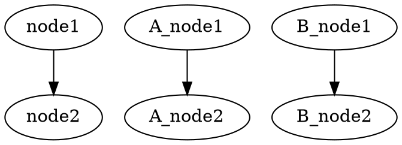

[](https://github.com/kamiazya/ts-graphviz/actions?workflow=NodeCI) [](https://badge.fury.io/js/ts-graphviz) [](https://opensource.org/licenses/MIT) [](https://github.com/prettier/prettier) [](https://codeclimate.com/github/kamiazya/ts-graphviz/maintainability) [](https://codeclimate.com/github/kamiazya/ts-graphviz/test_coverage) [](http://makeapullrequest.com) <!-- ALL-CONTRIBUTORS-BADGE:START - Do not remove or modify this section -->[](#contributors-)<!-- ALL-CONTRIBUTORS-BADGE:END -->

# ts-graphviz

[Graphviz](https://graphviz.gitlab.io/) library for TypeScript.

## Key Feature

- Export Dot language.
- Support Node.js and Browser.
  - UMD, ESM, CommonJS
- No dependency.

## Installation

The plugin can then be installed using [npm](https://www.npmjs.com/):

[](https://nodei.co/npm/ts-graphviz/)

### Package manager

```bash
# yarn
yarn add ts-graphviz
# or npm
npm install ts-graphviz
```

### Browser

```html
<script src="//unpkg.com/ts-graphviz/lib/bundle.min.js"></script>
```

## Usage

### Script

```typescript
import { digraph } from 'ts-graphviz';

const g = digraph('G');

const subgraphA = g.createSubgraph('A');
const nodeA1 = subgraphA.createNode('A_node1');
const nodeA2 = subgraphA.createNode('A_node2');
subgraphA.createEdge(nodeA1, nodeA2);

const subgraphB = g.createSubgraph('B');
const nodeB1 = subgraphB.createNode('B_node1');
const nodeB2 = subgraphB.createNode('B_node2');
subgraphA.createEdge(nodeB1, nodeB2);

const node1 = g.createNode('node1');
const node2 = g.createNode('node2');
g.createEdge(node1, node2);
const dot = g.toDot();
console.log(dot);
```

### Callback style API

```typescript
import { digraph } from 'ts-graphviz';

const G = digraph('G', g => {
  g.subgraph('A', A => {
    const node1 = A.node('A_node1');
    const node2 = A.node('A_node2');
    A.edge([node1, node2]);
  });
  g.subgraph('B', B => {
    const node1 = B.node('B_node1');
    const node2 = B.node('B_node2');
    B.edge([node1, node2]);
  });
  g.edge(['node1', 'node2']);
});
const dot = G.toDot();
console.log(dot);
```

### Output



## Contributing

For more info on how to contribute to ts-graphviz, see the [docs](./CONTRIBUTING.md).

## See Also

Graphviz-dot Test and Integration

- [jest-graphviz](https://github.com/kamiazya/jest-graphviz)
  - Jest matchers that supports graphviz integration.
- [setup-graphviz](https://github.com/kamiazya/setup-graphviz)
  - GitHub Action to set up Graphviz cross-platform(Linux, macOS, Windows).

## Contributors

Thanks goes to these wonderful people ([emoji key](https://allcontributors.org/docs/en/emoji-key)):

<!-- ALL-CONTRIBUTORS-LIST:START - Do not remove or modify this section -->
<!-- prettier-ignore-start -->
<!-- markdownlint-disable -->
<table>
  <tr>
    <td align="center"><a href="http://blog.kamiazya.tech/"><br /><sub><b>Yuki Yamazaki</b></sub></a><br /><a href="https://github.com/kamiazya/ts-graphviz/commits?author=kamiazya" title="Code">💻</a> <a href="https://github.com/kamiazya/ts-graphviz/commits?author=kamiazya" title="Tests">⚠️</a> <a href="https://github.com/kamiazya/ts-graphviz/commits?author=kamiazya" title="Documentation">📖</a> <a href="#ideas-kamiazya" title="Ideas, Planning, & Feedback">🤔</a></td>
  </tr>
</table>

<!-- markdownlint-enable -->
<!-- prettier-ignore-end -->
<!-- ALL-CONTRIBUTORS-LIST:END -->

This project follows the [all-contributors](https://github.com/all-contributors/all-contributors)
specification. Contributions of any kind welcome!

## License

This software is released under the MIT License, see LICENSE.
