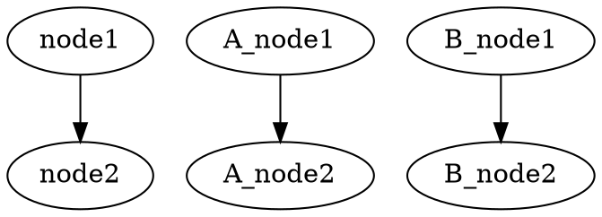

[](https://github.com/kamiazya/ts-graphviz/actions?workflow=NodeCI) [](https://badge.fury.io/js/ts-graphviz) [](https://opensource.org/licenses/MIT) [](https://github.com/prettier/prettier) [](https://codeclimate.com/github/kamiazya/ts-graphviz/maintainability) [](https://codeclimate.com/github/kamiazya/ts-graphviz/test_coverage)

# ts-graphviz

[Graphviz](https://graphviz.gitlab.io/) library for TypeScript.

## Installation

The plugin can then be installed using [npm](https://www.npmjs.com/):

[](https://nodei.co/npm/ts-graphviz/)

### yarn

```bash
yarn add ts-graphviz
```

### npm

```bash
npm install ts-graphviz
```

## Usage

### Script

```typescript
import { digraph } from 'ts-graphviz';

const g = digraph();

const subgraphA = g.createSubgraph('A');
const nodeA1 = subgraphA.createNode('A_node1');
const nodeA2 = subgraphA.createNode('A_node2');
subgraphA.createEdge(nodeA1, nodeA2);

const subgraphB = g.createSubgraph('B');
const nodeB1 = subgraphB.createNode('B_node1');
const nodeB2 = subgraphB.createNode('B_node2');
subgraphA.createEdge(nodeB1, nodeB2);

const node1 = g.createNode('node1');
const node2 = g.createNode('node2');
g.createEdge(node1, node2);
const dot = g.toDot();
console.log(dot);
```

### Callback style API

```typescript
import { digraph } from 'ts-graphviz';

const G = digraph('G', g => {
  g.subgraph('A', A => {
    const node1 = A.node('A_node1');
    const node2 = A.node('A_node2');
    A.edge([node1, node2]);
  });
  g.subgraph('B', B => {
    const node1 = B.node('B_node1');
    const node2 = B.node('B_node2');
    B.edge([node1, node2]);
  });
  g.edge(['node1', 'node2']);
});
const dot = G.toDot();
console.log(dot);
```

### Output



## License

This software is released under the MIT License, see LICENSE.

## Author

[kamiazya(Yuki Yamazaki)](https://github.com/kamiazya)

[](https://ko-fi.com/W7W5VDNO)
