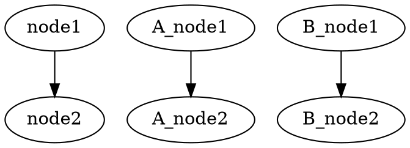
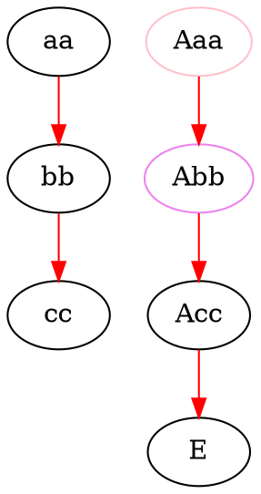
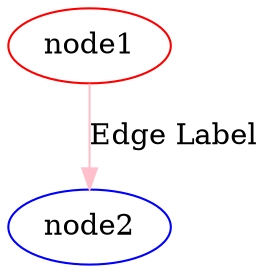
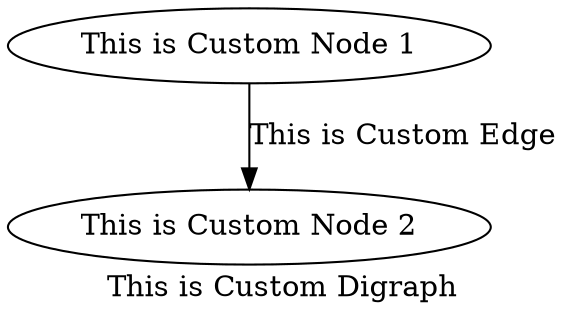

[](https://github.com/kamiazya/ts-graphviz/actions?workflow=NodeCI) [](https://badge.fury.io/js/ts-graphviz) [](https://opensource.org/licenses/MIT) [](https://github.com/prettier/prettier) [](https://codeclimate.com/github/kamiazya/ts-graphviz/maintainability) [](https://codeclimate.com/github/kamiazya/ts-graphviz/test_coverage) [](http://makeapullrequest.com) <!-- ALL-CONTRIBUTORS-BADGE:START - Do not remove or modify this section -->
[](#contributors-)
<!-- ALL-CONTRIBUTORS-BADGE:END -->

# ts-graphviz

[Graphviz](https://graphviz.gitlab.io/) library for TypeScript.

## Key Feature

- Export Dot language.
- Support Node.js and Browser.
  - UMD, ESM, CommonJS

## Installation

The plugin can then be installed using [npm](https://www.npmjs.com/):

[](https://nodei.co/npm/ts-graphviz/)

### Package manager

```bash
# yarn
yarn add ts-graphviz
# or npm
npm install ts-graphviz
```

### Browser

```html
<script src="//unpkg.com/ts-graphviz/lib/bundle.min.js"></script>
```

## Examples

### Script style

```typescript
import { digraph, toDot } from 'ts-graphviz';

const g = digraph('G');

const subgraphA = g.createSubgraph('A');
const nodeA1 = subgraphA.createNode('A_node1');
const nodeA2 = subgraphA.createNode('A_node2');
subgraphA.createEdge([nodeA1, nodeA2]);

const subgraphB = g.createSubgraph('B');
const nodeB1 = subgraphB.createNode('B_node1');
const nodeB2 = subgraphB.createNode('B_node2');
subgraphA.createEdge([nodeB1, nodeB2]);

const node1 = g.createNode('node1');
const node2 = g.createNode('node2');
g.createEdge([node1, node2]);
const dot = toDot(g);
console.log(dot);
```



### Callback style

```typescript
import { digraph, toDot } from 'ts-graphviz';

 const G = digraph('G', (g) => {
  const a = g.node('aa');
  const b = g.node('bb');
  const c = g.node('cc');
  g.edge([a, b, c], {
    [attribute.color]: 'red'
  });
  g.subgraph('A', (A) => {
    const Aa = A.node('Aaa', {
      [attribute.color]: 'pink'
    });

    const Ab = A.node('Abb', {
      [attribute.color]: 'violet'
    });
    const Ac = A.node('Acc');
    A.edge([Aa.port('a'), Ab, Ac, 'E'], {
      [attribute.color]: 'red'
    });
  });
});
console.log(dot);
```



### Class base API

```typescript
import { attribute, Digraph, Subgraph, Node, Edge, toDot } from 'ts-graphviz';

const G = new Digraph();
const A = new Subgraph('A');
const node1 = new Node('node1', {
  [attribute.color]: 'red'
});
const node2 = new Node('node2', {
  [attribute.color]: 'blue'
});
const edge = new Edge([node1, node2], {
  [attribute.label]: 'Edge Label',
  [attribute.color]: 'pink'
});
G.addSubgraph(A);
A.addNode(node1);
A.addNode(node2);
A.addEdge(edge);
const dot = toDot(G);
console.log(dot);
```



### Custom Classes

```typescript
import { Digraph, Node, Edge, EdgeTarget, attribute, toDot } from 'ts-graphviz';

class MyCustomDigraph extends Digraph {
  constructor() {
    super('G', {
      [attribute.label]: 'This is Custom Digraph',
    });
  }
}
class MyCustomNode extends Node {
  constructor(id: number) {
    super(`node${id}`, {
      [attribute.label]: `This is Custom Node ${id}`
    });
  }
}

class MyCustomEdge extends Edge {
  constructor(targets: ReadonlyArray<EdgeTarget>) {
    super(targets, {
      [attribute.label]: 'This is Custom Edge'
    });
  }
}

const digraph = new MyCustomDigraph();
const node1 = new MyCustomNode(1);
const node2 = new MyCustomNode(2);
const edge = new MyCustomEdge([node1, node2]);
digraph.addNode(node1);
digraph.addNode(node2);
digraph.addEdge(edge);
const dot = toDot(g);
console.log(dot);
```



## See Also

Graphviz-dot Test and Integration

- [@ts-graphviz/react](https://github.com/ts-graphviz/react)
  - Graphviz-dot Renderer for React.
- [jest-graphviz](https://github.com/ts-graphviz/jest-graphviz)
  - Jest matchers that supports graphviz integration.
- [setup-graphviz](https://github.com/ts-graphviz/setup-graphviz)
  - GitHub Action to set up Graphviz cross-platform(Linux, macOS, Windows).

## Contributors

Thanks goes to these wonderful people ([emoji key](https://allcontributors.org/docs/en/emoji-key)):

<!-- ALL-CONTRIBUTORS-LIST:START - Do not remove or modify this section -->
<!-- prettier-ignore-start -->
<!-- markdownlint-disable -->
<table>
  <tr>
    <td align="center"><a href="http://blog.kamiazya.tech/"><br /><sub><b>Yuki Yamazaki</b></sub></a><br /><a href="https://github.com/ts-graphviz/ts-graphviz/commits?author=kamiazya" title="Code">💻</a> <a href="https://github.com/ts-graphviz/ts-graphviz/commits?author=kamiazya" title="Tests">⚠️</a> <a href="https://github.com/ts-graphviz/ts-graphviz/commits?author=kamiazya" title="Documentation">📖</a> <a href="#ideas-kamiazya" title="Ideas, Planning, & Feedback">🤔</a></td>
    <td align="center"><a href="https://laysent.com"><br /><sub><b>LaySent</b></sub></a><br /><a href="https://github.com/ts-graphviz/ts-graphviz/issues?q=author%3Alaysent" title="Bug reports">🐛</a> <a href="https://github.com/ts-graphviz/ts-graphviz/commits?author=laysent" title="Tests">⚠️</a></td>
    <td align="center"><a href="https://github.com/elasticdotventures"><br /><sub><b>elasticdotventures</b></sub></a><br /><a href="https://github.com/ts-graphviz/ts-graphviz/commits?author=elasticdotventures" title="Documentation">📖</a></td>
  </tr>
</table>

<!-- markdownlint-enable -->
<!-- prettier-ignore-end -->
<!-- ALL-CONTRIBUTORS-LIST:END -->

This project follows the [all-contributors](https://github.com/all-contributors/all-contributors)
specification. Contributions of any kind welcome!

## Contributing

For more info on how to contribute to ts-graphviz, see the [docs](./CONTRIBUTING.md).

## License

This software is released under the MIT License, see [LICENSE](./LICENSE).
