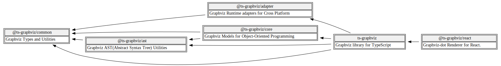
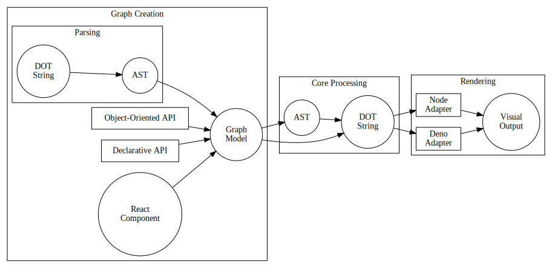

<div align="center">

[](https://github.com/ts-graphviz/ts-graphviz/actions/workflows/main.yaml)
[](https://github.com/ts-graphviz/ts-graphviz/actions/workflows/codeql-analysis.yml)
[](https://github.com/ts-graphviz/ts-graphviz/blob/main/LICENSE)
[](#contributors-)

[](https://www.bestpractices.dev/projects/8396)
[](https://scorecard.dev/viewer/?uri=github.com/ts-graphviz/ts-graphviz)
[](https://tidelift.com/subscription/pkg/npm-ts-graphviz?utm_source=npm-ts-graphviz&utm_medium=readme)

[](https://badge.fury.io/js/ts-graphviz)

[](https://github.com/denoland/deno)
[](https://npmtrends.com/ts-graphviz)

# ts-graphviz

[Graphviz](https://graphviz.gitlab.io/) library for TypeScript.

🔗

[](https://github.com/ts-graphviz/ts-graphviz)
[](https://www.npmjs.com/package/ts-graphviz)
[](https://ts-graphviz.github.io/ts-graphviz/)
[](https://deepwiki.com/ts-graphviz/ts-graphviz)

[](https://github.com/sponsors/ts-graphviz)
[](https://opencollective.com/ts-graphviz)

[](https://biomejs.dev/)
[](https://vitest.dev/)
[](https://rollupjs.org/)

</div>

---

## What is ts-graphviz? 🎯

**ts-graphviz** is a comprehensive TypeScript library that provides tools for creating, manipulating, and rendering Graphviz graph descriptions.
It offers a type-safe, object-oriented approach to working with the DOT language, which is used by Graphviz for defining graph visualizations.

## Key Features ✨

**ts-graphviz** offers several distinctive features that make it valuable for TypeScript/JavaScript developers working with graph visualizations:

- **TypeScript-friendly API**
  - Provides fully typed models for the DOT language with type definitions for graph attributes.
- **Flexible Programming Paradigms**
  - Supports both object-oriented and declarative approaches.
- **Multi-level API**
  - Offers high-level model APIs and low-level AST manipulation.
- **Modular Design**
  - Structured as separate packages for specific functionalities.
- **Cross-platform Support**
  - Works in Node.js and Deno environments
- **Extensible**
  - Allows extending the type system for custom graph visualization solutions.

## Why ts-graphviz? 🤔

**ts-graphviz** is designed to make it easier for TypeScript and JavaScript developers to work with Graphviz by providing a type-safe, object-oriented API that abstracts away the complexities of the DOT language. It allows developers to create and manipulate graphs programmatically, making it suitable for both small-scale projects and large applications.
It is particularly useful for applications that require dynamic graph generation, such as data visualization tools, network analysis, and more.

## Getting Started 🚀

### Installation 💽

#### Node.js

This package can then be installed using a package manager.

```bash
# npm
$ npm install -S ts-graphviz
# or yarn
$ yarn add ts-graphviz
# or pnpm
$ pnpm add ts-graphviz
```

> **Note** Want to try before installing? Check out [Runkit](https://npm.runkit.com/ts-graphviz) to see how it works.

#### Deno 🦕

[Deno v1.28 and above supports npm](https://deno.land/manual/node/npm_specifiers).

You can install and use the package by specifying the following:

```ts
import { toDot } from 'npm:ts-graphviz';
```

### Basic Usage 📖

ts-graphviz provides two main approaches to create graph visualizations:

#### Object-Oriented API

Create graphs using object-oriented programming with classes:

```typescript
import { attribute as _, Digraph, Subgraph, Node, Edge, toDot } from 'ts-graphviz';

// Create a directed graph
const graph = new Digraph();

// Create nodes
const node1 = new Node('node1', { color: 'red' });
const node2 = new Node('node2', { color: 'blue' });

// Create an edge between the nodes
const edge = new Edge([node1, node2], { label: 'Edge Label' });

// Add elements to the graph
graph.addNode(node1);
graph.addNode(node2);
graph.addEdge(edge);

// Convert to DOT language
const dot = toDot(graph);

// Convert to DOT language
const dot = toDot(G);
// digraph {
//   "node1" [
//     color = "red",
//   ];
//   "node2" [
//     color = "blue",
//   ];
//   "node1" -> "node2" [
//     label = "Edge Label",
//   ];
// }
```

#### Declarative API

Create graphs using a declarative approach:

```ts
import { attribute as _, digraph, toDot } from 'ts-graphviz';

// Create a directed graph using the factory function
const graph = digraph('G', (g) => {
  // Create nodes within the graph context
  const a = g.node('a');
  const b = g.node('b');

  // Create an edge between nodes
  g.edge([a, b], { label: 'connects to' });

  // Create a subgraph with its own nodes and edges
  g.subgraph('A', (sg) => {
    const c = sg.node('c');
    const d = sg.node('d');
    sg.edge([c, d]);
  });
});

// Convert to DOT language
const dot = toDot(graph);
// digraph G {
//   "a";
//   "b";
//   "a" -> "b" [
//     label = "connects to",
//   ];
//   subgraph "A" {
//     "c";
//     "d";
//     "c" -> "d";
//   }
// }
```

## Useful Links 🔗

### Documentation 📖

More detailed documentation and examples can be found in the following resources:

- [API Reference](https://ts-graphviz.github.io/ts-graphviz/)
  - See the **API Reference** for detailed documentation on how to use the library.
- [DeepWiki](https://deepwiki.com/ts-graphviz/ts-graphviz)
  - See the AI generated documentation for more information.
- [Website](https://ts-graphviz.github.io/)
  - The official website for **ts-graphviz**.


### Architecture 🏛

See [ARCHITECTURE.md](./ARCHITECTURE.md) for more details.

### Security 🛡️

See [SECURITY.md](./SECURITY.md) for more details.


## Package Structure 📦

The **ts-graphviz** repository is structured as a monorepo containing several packages, each with a specific responsibility:

| Package | Purpose |
| --- | --- |
| [ts-graphviz](./packages/ts-graphviz/README.md) | Main entry point providing a high-level API for most users |
| [@ts-graphviz/core](./packages/@ts-graphviz/core/README.md) | Core object models for graph manipulation |
| [@ts-graphviz/ast](./packages/@ts-graphviz/ast/README.md) | Parser and AST (Abstract Syntax Tree) handling for DOT language |
| [@ts-graphviz/adapter](./packages/@ts-graphviz/adapter/README.md) | Platform-specific implementations for rendering graphs |
| [@ts-graphviz/common](./packages/@ts-graphviz/common/README.md) | Shared types and utilities used across packages |
| [@ts-graphviz/react](./packages/@ts-graphviz/react/README.md) | React components for creating and rendering Graphviz graphs |

> [!TIP]
> 
> _Packages' Dependency graph_

## Data Flow and Processing Pipeline 🔄

The following diagram illustrates how data flows through the ts-graphviz system, from graph creation to final rendering:



1. **Creation Phase**: Users create graph models through object-oriented API, React components, or parsing DOT strings
2. **Processing Phase**: Models are converted to AST and then to DOT language strings
3. **Rendering Phase**: Platform-specific adapters convert DOT strings to visual output formats
    1. The adapters handle platform-specific operations, such as executing the Graphviz dot command in Node.js/Deno, while maintaining a consistent API across environments.

> [!TIP]
> Rendering in the browser is not directly supported by this library, but you can use other libraries like [@hpcc-js/wasm-graphviz](https://www.npmjs.com/package/@hpcc-js/wasm-graphviz) to achieve rendering in the browser.

### Key Data Transformations:

- **Model** -> **AST**: Converts object model to abstract syntax tree
- **AST** -> **DOT**: Generates DOT language string from AST
- **DOT** -> **AST**: Parses DOT language into AST
- **AST** -> **Model**: Converts AST back to object model
- **DOT** -> **Output**: Uses adapters to render visual outputs

The `toDot()` function from the **ts-graphviz** package is a composite of `fromModel()` and `stringify()`, while the `fromDot()` function is a composite of `parse()` and `toModel()`.

## Who's using `ts-graphviz` 📜

- [Apollo GraphQL](https://github.com/apollographql)
- [Apple](https://github.com/apple/ml-mycelium)
- [AWS](https://github.com/aws)
- [IBM (StrongLoop)](https://strongloop.com)
- [The University of Tokyo](https://github.com/csg-tokyo)
- [Transmute](https://github.com/transmute-industries)

> [!NOTE]
> Let us know that you're using `ts-graphviz` on [GitHub Discussions](https://github.com/ts-graphviz/ts-graphviz/discussions/736) 🙏


## Related Projects 💫

Related projects can be found at [**ts-graphviz** GitHub Organization](https://github.com/ts-graphviz).

The TypeScript/JavaScript ecosystem provides a variety of OSS with the goal of making Graphviz more connected and easier to use.

## Contributors 👥

Thanks goes to these wonderful people ([emoji key](https://allcontributors.org/docs/en/emoji-key)):

<!-- ALL-CONTRIBUTORS-LIST:START - Do not remove or modify this section -->
<!-- prettier-ignore-start -->
<!-- markdownlint-disable -->
<table>
  <tbody>
    <tr>
      <td align="center" valign="top" width="14.28%"><a href="http://blog.kamiazya.tech/"><br /><sub><b>Yuki Yamazaki</b></sub></a><br /><a href="https://github.com/ts-graphviz/ts-graphviz/commits?author=kamiazya" title="Code">💻</a> <a href="https://github.com/ts-graphviz/ts-graphviz/commits?author=kamiazya" title="Tests">⚠️</a> <a href="https://github.com/ts-graphviz/ts-graphviz/commits?author=kamiazya" title="Documentation">📖</a> <a href="#ideas-kamiazya" title="Ideas, Planning, & Feedback">🤔</a></td>
      <td align="center" valign="top" width="14.28%"><a href="https://laysent.com"><br /><sub><b>LaySent</b></sub></a><br /><a href="https://github.com/ts-graphviz/ts-graphviz/issues?q=author%3Alaysent" title="Bug reports">🐛</a> <a href="https://github.com/ts-graphviz/ts-graphviz/commits?author=laysent" title="Tests">⚠️</a></td>
      <td align="center" valign="top" width="14.28%"><a href="https://github.com/elasticdotventures"><br /><sub><b>elasticdotventures</b></sub></a><br /><a href="https://github.com/ts-graphviz/ts-graphviz/commits?author=elasticdotventures" title="Documentation">📖</a></td>
      <td align="center" valign="top" width="14.28%"><a href="https://github.com/ChristianMurphy"><br /><sub><b>Christian Murphy</b></sub></a><br /><a href="https://github.com/ts-graphviz/ts-graphviz/commits?author=ChristianMurphy" title="Code">💻</a> <a href="#ideas-ChristianMurphy" title="Ideas, Planning, & Feedback">🤔</a> <a href="https://github.com/ts-graphviz/ts-graphviz/commits?author=ChristianMurphy" title="Documentation">📖</a></td>
      <td align="center" valign="top" width="14.28%"><a href="https://github.com/ArtemAdamenko"><br /><sub><b>Artem</b></sub></a><br /><a href="https://github.com/ts-graphviz/ts-graphviz/issues?q=author%3AArtemAdamenko" title="Bug reports">🐛</a></td>
      <td align="center" valign="top" width="14.28%"><a href="https://github.com/fredericohpandolfo"><br /><sub><b>fredericohpandolfo</b></sub></a><br /><a href="https://github.com/ts-graphviz/ts-graphviz/issues?q=author%3Afredericohpandolfo" title="Bug reports">🐛</a></td>
      <td align="center" valign="top" width="14.28%"><a href="https://github.com/diegoquinteiro"><br /><sub><b>diegoquinteiro</b></sub></a><br /><a href="https://github.com/ts-graphviz/ts-graphviz/issues?q=author%3Adiegoquinteiro" title="Bug reports">🐛</a></td>
    </tr>
    <tr>
      <td align="center" valign="top" width="14.28%"><a href="https://github.com/robross0606"><br /><sub><b>robross0606</b></sub></a><br /><a href="#ideas-robross0606" title="Ideas, Planning, & Feedback">🤔</a></td>
      <td align="center" valign="top" width="14.28%"><a href="https://blake-regalia.net"><br /><sub><b>Blake Regalia</b></sub></a><br /><a href="https://github.com/ts-graphviz/ts-graphviz/issues?q=author%3Ablake-regalia" title="Bug reports">🐛</a></td>
      <td align="center" valign="top" width="14.28%"><a href="https://github.com/bigbug"><br /><sub><b>bigbug</b></sub></a><br /><a href="#question-bigbug" title="Answering Questions">💬</a></td>
      <td align="center" valign="top" width="14.28%"><a href="https://github.com/murawakimitsuhiro"><br /><sub><b>mrwk</b></sub></a><br /><a href="#question-murawakimitsuhiro" title="Answering Questions">💬</a></td>
      <td align="center" valign="top" width="14.28%"><a href="https://github.com/svdvonde"><br /><sub><b>svdvonde</b></sub></a><br /><a href="#question-svdvonde" title="Answering Questions">💬</a></td>
      <td align="center" valign="top" width="14.28%"><a href="https://github.com/seethroughdev"><br /><sub><b>Adam</b></sub></a><br /><a href="#question-seethroughdev" title="Answering Questions">💬</a></td>
      <td align="center" valign="top" width="14.28%"><a href="https://github.com/trevor-scheer"><br /><sub><b>Trevor Scheer</b></sub></a><br /><a href="#a11y-trevor-scheer" title="Accessibility">️️️️♿️</a></td>
    </tr>
    <tr>
      <td align="center" valign="top" width="14.28%"><a href="https://pre.ms"><br /><sub><b>Prem Pillai</b></sub></a><br /><a href="https://github.com/ts-graphviz/ts-graphviz/issues?q=author%3Acloud-on-prem" title="Bug reports">🐛</a></td>
      <td align="center" valign="top" width="14.28%"><a href="https://github.com/nagasawaryoya"><br /><sub><b>nagasawaryoya</b></sub></a><br /><a href="https://github.com/ts-graphviz/ts-graphviz/commits?author=nagasawaryoya" title="Code">💻</a> <a href="https://github.com/ts-graphviz/ts-graphviz/commits?author=nagasawaryoya" title="Tests">⚠️</a></td>
      <td align="center" valign="top" width="14.28%"><a href="https://github.com/tokidrill"><br /><sub><b>YukiSasaki</b></sub></a><br /><a href="https://github.com/ts-graphviz/ts-graphviz/commits?author=tokidrill" title="Code">💻</a> <a href="https://github.com/ts-graphviz/ts-graphviz/commits?author=tokidrill" title="Tests">⚠️</a></td>
      <td align="center" valign="top" width="14.28%"><a href="https://github.com/Madd0g"><br /><sub><b>Madd0g</b></sub></a><br /><a href="https://github.com/ts-graphviz/ts-graphviz/issues?q=author%3AMadd0g" title="Bug reports">🐛</a></td>
      <td align="center" valign="top" width="14.28%"><a href="https://github.com/j4k0xb"><br /><sub><b>j4k0xb</b></sub></a><br /><a href="https://github.com/ts-graphviz/ts-graphviz/issues?q=author%3Aj4k0xb" title="Bug reports">🐛</a></td>
      <td align="center" valign="top" width="14.28%"><a href="https://github.com/haved"><br /><sub><b>HKrogstie</b></sub></a><br /><a href="https://github.com/ts-graphviz/ts-graphviz/issues?q=author%3Ahaved" title="Bug reports">🐛</a></td>
      <td align="center" valign="top" width="14.28%"><a href="https://github.com/septatrix"><br /><sub><b>Nils K</b></sub></a><br /><a href="https://github.com/ts-graphviz/ts-graphviz/issues?q=author%3Aseptatrix" title="Bug reports">🐛</a></td>
    </tr>
    <tr>
      <td align="center" valign="top" width="14.28%"><a href="https://github.com/hao2013"><br /><sub><b>hao2013</b></sub></a><br /><a href="#maintenance-hao2013" title="Maintenance">🚧</a> <a href="https://github.com/ts-graphviz/ts-graphviz/pulls?q=is%3Apr+reviewed-by%3Ahao2013" title="Reviewed Pull Requests">👀</a></td>
      <td align="center" valign="top" width="14.28%"><a href="http://www.walterra.dev"><br /><sub><b>Walter Rafelsberger</b></sub></a><br /><a href="#question-walterra" title="Answering Questions">💬</a></td>
    </tr>
  </tbody>
</table>

<!-- markdownlint-restore -->
<!-- prettier-ignore-end -->

<!-- ALL-CONTRIBUTORS-LIST:END -->

This project follows the [all-contributors](https://github.com/all-contributors/all-contributors)
specification. Contributions of any kind welcome!

## How to Contribute 💪

The easiest way to contribute is to use the library and star [repository](https://github.com/ts-graphviz/ts-graphviz).

### Questions 💭

Feel free to ask questions on [GitHub Discussions](https://github.com/ts-graphviz/ts-graphviz/discussions).

### Report bugs / request additional features 💡

Please register at [GitHub Issues](https://github.com/ts-graphviz/ts-graphviz/issues/new/choose).

### Development / Bug Fixes 🧑‍💻

See [CONTRIBUTING.md](./CONTRIBUTING.md).

### Financial Support 💸

Support this project by becoming a sponsor. Your logo will show up here with a link to your website. [Become a sponsor](https://opencollective.com/ts-graphviz)


Thank you to all our backers! 🙏 [Become a backer](https://opencollective.com/ts-graphviz)


Please support ts-graphviz on [Open Collective](https://opencollective.com/ts-graphviz) or [GitHub Sponsors](https://github.com/sponsors/ts-graphviz).

> **Note** Even just a dollar is enough motivation to develop 😊

## ts-graphviz for Enterprise 🏢

Available as part of the Tidelift Subscription.

The maintainers of ts-graphviz and thousands of other packages are working with Tidelift to deliver commercial support and maintenance for the open-source dependencies you use to build your applications.
Save time, reduce risk, and improve code health, while paying the maintainers of the exact dependencies you use.

[Learn more](https://tidelift.com/subscription/pkg/npm-ts-graphviz?utm_source=npm-ts-graphviz&utm_medium=referral&utm_campaign=enterprise&utm_term=repo).

## License ⚖️

This software is released under the MIT License, see [LICENSE](https://github.com/ts-graphviz/ts-graphviz/blob/main/LICENSE).
