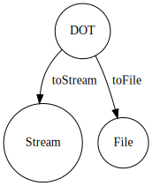

[](https://app.codacy.com/gh/ts-graphviz/ts-graphviz?utm_source=github.com&utm_medium=referral&utm_content=ts-graphviz/ts-graphviz&utm_campaign=Badge_Grade_Settings)
[](https://github.com/kamiazya/ts-graphviz/actions?workflow=NodeCI)
[](https://badge.fury.io/js/ts-graphviz)
[](https://opensource.org/licenses/MIT)
[](http://makeapullrequest.com)
[](https://github.com/facebook/jest)
[](https://github.com/facebook/jest)

[](https://github.com/denoland/deno)

[](#contributors)
[](https://tidelift.com/subscription/pkg/npm-ts-graphviz?utm_source=npm-ts-graphviz&utm_medium=readme)

# ts-graphviz

[Graphviz](https://graphviz.gitlab.io/) library for TypeScript.

[](https://github.com/ts-graphviz/ts-graphviz)
[](https://www.npmjs.com/package/ts-graphviz)
[](https://yarnpkg.com/package/ts-graphviz)
[](https://ts-graphviz.github.io/ts-graphviz/)
[](https://github.com/sponsors/kamiazya)

> [English](https://github.com/ts-graphviz/ts-graphviz/blob/main/README.md) | [日本語](https://github.com/ts-graphviz/ts-graphviz/blob/main/README_ja.md)

## Key Features ✨

`ts-graphviz` package provides models and ASTs for the Graphviz DOT language fully integrated with TypeScript.

- **TypeScript-friendly API**
  - It provides models in the DOT language. TypeScript type definitions are also provided for attributes and even attribute types.
- **Freedom from programming paradigms**
  - Designed to be object-oriented, it provides APIs that can be adapted to both imperative and declarative APIs. You can choose the paradigm that best fits your project.
- **Suitable for any use cases**
  - Both a high-layer API to provide models and a low-layer API to handle ASTs are provided to address any use cases.

## Installation 💽

### Node.js

This package can then be installed using a package manager.

```bash
# npm
$ npm install -S ts-graphviz
# or yarn
$ yarn add ts-graphviz
# or pnpm
$ pnpm add ts-graphviz
```

> **Note** Want to try before installing? Check out [Runkit](https://npm.runkit.com/ts-graphviz) to see how it works.

### Deno 🦕

[Deno v1.28 and above supports npm](https://deno.land/manual/node/npm_specifiers).

You can install and use the package by specifying the following:

```ts
import { toDot } from 'npm:ts-graphviz';
```

## Usage 📑

This section provides an overview of the package.

For more detailed API specifications, please refer to the comments in the TypeScript type definitions and the [document](https://ts-graphviz.github.io/ts-graphviz/) automatically generated based on them.

### `ts-graphviz` Module 🚩

This module provides **Model**, an interface for working with the DOT language in JavaScript/TypeScript.


#### Object-Oriented ❤️

**Model** is designed to be object-oriented and provides classes `Digraph`, `Graph`, `Subgraph`, `Node`, and `Edge`.

Provides a `toDot` function to convert **Model** to **DOT** (DOT language string).

```typescript
import { attribute as _, Digraph, Subgraph, Node, Edge, toDot } from 'ts-graphviz';

const G = new Digraph();
const A = new Subgraph('A');
const node1 = new Node('node1', {
  [_.color]: 'red'
});
const node2 = new Node('node2', {
  [_.color]: 'blue'
});
const edge = new Edge([node1, node2], {
  [_.label]: 'Edge Label',
  [_.color]: 'pink'
});
G.addSubgraph(A);
A.addNode(node1);
A.addNode(node2);
A.addEdge(edge);
const dot = toDot(G);
// digraph {
//   subgraph "A" {
//     "node1" [
//       color = "red",
//     ];
//     "node2" [
//       color = "blue",
//     ];
//     "node1" -> "node2" [
//       label = "Edge Label",
//       color = "pink",
//     ];
//   }
// }
```

<details>
<summary>Advanced Usage</summary>

##### Custom Class 🤖

You can also add your own implementation by inheriting from the class.

```typescript
import { Digraph, Node, Edge, EdgeTargetTuple, attribute as _, toDot } from 'ts-graphviz';

class MyCustomDigraph extends Digraph {
  constructor() {
    super('G', {
      [_.label]: 'This is Custom Digraph',
    });
  }
}
class MyCustomNode extends Node {
  constructor(id: string) {
    super(`node_${id}`, {
      [_.label]: `This is Custom Node ${id}`,
    });
  }
}

class MyCustomEdge extends Edge {
  constructor(targets: EdgeTargetTuple) {
    super(targets, {
      [_.label]: 'This is Custom Edge',
    });
  }
}

const digraph = new MyCustomDigraph();
const node1 = new MyCustomNode('A');
const node2 = new MyCustomNode('B');
const edge = new MyCustomEdge([node1, node2]);
digraph.addNode(node1);
digraph.addNode(node2);
digraph.addEdge(edge);
const dot = toDot(digraph);
// digraph "G" {
//   label = "This is Custom Digraph";
//   "node_A" [
//     label = "This is Custom Node A";
//   ];
//   "node_B" [
//     label = "This is Custom Node B";
//   ];
//   "node_A" -> "node_B" [
//     label = "This is Custom Edge";
//   ];
// }
```

##### Models Context API ( `with` method) 🧅

You can also use the _Models Context API_ to create custom classes for objects generated inside of Graph.


The `with` methods of `Digraph`, `Graph`, and `Subgraph`, which are implementations of `GraphBaseModel`, are provided to predefine custom models.

```typescript
const g = new Digraph();
g.with({
  Node: MyCustomNode,
  Edge: MyCustomEdge,
});
const a = g.createNode('A'); // MyCustomNode
const b = g.createNode('B'); // MyCustomNode
g.createEdge([a, b]); // MyCustomEdge
const dot = toDot(g);
// digraph {
//   "node_A" [
//     label = "This is Custom Node A";
//   ];
//   "node_B" [
//     label = "This is Custom Node B";
//   ];
//   "node_A" -> "node_B" [
//     label = "This is Custom Edge";
//   ];
// }
```

##### `fromDot` function ⏪

> The status of this function is ! [beta](https://img.shields.io/badge/-beta-orange).

The main scenario for using this library is to use the `toDot` function, but it also supports conversions in the reverse direction.

By converting **DOT** to **Model**, a portion of the code can be written in the DOT language.

```typescript
const G = fromDot(
  `digraph {
    node_A [
      label = "This is a Label of Node A";
    ];
  }`,
);

G.edge(['node_A', 'node_B']);

const dot = toDot(G)
// digraph {
//   "node_A" [
//     label = "This is a Label of Node A";
//   ];
//   "node_A" -> "node_B";
// }
```

</details>

#### Declarative API 😎

When creating `Graph` or `Digraph`, you can use _Model Factory_ to provide a notation more similar to the **DOT** language.

**Model** also has a declarative API, so you can consistently choose a declarative paradigm.


```typescript
import { attribute as _, digraph, toDot } from 'ts-graphviz';

 const G = digraph('G', (g) => {
  const a = g.node('aa');
  const b = g.node('bb');
  const c = g.node('cc');
  g.edge([a, b, c], {
    [_.color]: 'red'
  });
  g.subgraph('A', (A) => {
    const Aa = A.node('Aaa', {
      [_.color]: 'pink'
    });

    const Ab = A.node('Abb', {
      [_.color]: 'violet'
    });
    const Ac = A.node('Acc');
    A.edge([Aa.port('a'), Ab, Ac, 'E'], {
      [_.color]: 'red'
    });
  });
});

const dot = toDot(G);
// digraph "G" {
//   "aa";
//   "bb";
//   "cc";
//   subgraph "A" {
//     "Aaa" [
//       color = "pink",
//     ];
//     "Abb" [
//       color = "violet",
//     ];
//     "Acc";
//     "Aaa":"a" -> "Abb" -> "Acc" -> "E" [
//       color = "red",
//     ];
//   }
//   "aa" -> "bb" -> "cc" [
//     color = "red",
//   ];
// }
```

> **Note** Of course, we also provide an API for creating strict mode graphs.
>
> ```typescript
> import { strict, toDot } from 'ts-graphviz';
>
> const G = strict.graph(...);
> const dot = toDot(G);
> // strict graph {
> // }
> ```


<details>
<summary>Advanced Usage</summary>

##### Models Context API ( `withContext` function ) 💈


The `withContext` function returns a _Model Factory_ function.

This _Model Factory_ provides a means to replace `RootGraphModel` with a custom class, such as `Digraph` or `Graph`.

This API provides a way to integrate declarative APIs and custom classes.

```typescript
const { digraph } = withContext({
  Digraph: MyCustomDigraph,
  Node: MyCustomNode,
  Edge: MyCustomEdge,
});

const G = digraph((g) => {
  const a = g.node('A'); // MyCustomNode
  const b = g.node('B'); // MyCustomNode
  g.edge([a, b]); // MyCustomEdge
});
const dot = toDot(g);
// digraph "G" {
//   label = "This is Custom Digraph";
//   "node_A" [
//     label = "This is Custom Node A";
//   ];
//   "node_B" [
//     label = "This is Custom Node B";
//   ];
//   "node_A" -> "node_B" [
//     label = "This is Custom Edge";
//   ];
// }
```

</details>

### `ts-graphviz/adapter` Module 🔌

> This module status is .


Provides an interface to run Graphviz dot commands.

[Graphviz](https://graphviz.gitlab.io/) must be installed so that the dot command can be executed.

Execute the dot command to output a DOT language string to a stream or file.



This module provides the following functions.

- The `toStream` function converts **DOT** to **Stream**.
    ```ts
    import { toStream } from 'ts-graphviz/adapter';

    const dot = `
      digraph example {
        node1 [
          label = "My Node",
        ]
      }
    `;

    const stream = await toStream(dot, { format: 'svg' });
    // Node.js
    stream.pipe(process.stdout);
    // Deno
    await stream.pipeTo(Deno.stdout.writable);
    ```
- Writes **DOT** to a file at the specified path `toFile` function
    ```ts
    import { toFile } from 'ts-graphviz/adapter';

    const dot = `
      digraph example {
        node1 [
          label = "My Node",
        ]
      }
    `;

    await toFile(dot, './result.svg', { format: 'svg' });
    ```

> **Note** Designed to work with Node.js and Deno, Stream is runtime native.

### `ts-graphviz/ast` Module 🔢

> This module status is .

An API is provided to handle ASTs for advanced use.


The following functions are provided as described in the state transition diagram.

- The `fromModel` function converts **Model** to **AST**.
- The `toModel` function converts **AST** to **Model**.
- The `stringify` function converts **AST** to **DOT**.
- The `parse` function to convert from **DOT** to **AST**.

> **Note** As you can see from the above figure, the `toDot` function provided by the `ts-graphviz` package is a composite of `fromModel` and `stringify`. The `fromDot` function is a composite of `parse` and `toModel`.

Detailed usage is TODO.
Please refer to the TypeScript type definition.


<details>
<summary>The parse function and AST</summary>


```typescript
import { parse } from 'ts-graphviz/ast';

const ast = parse(`
  digraph example {
    node1 [
      label = "My Node",
    ]
  }
`);
// {
//   type: 'Dot',
//   location: {
//     start: { offset: 3, line: 2, column: 3 },
//     end: { offset: 68, line: 7, column: 1 }
//   },
//   children: [
//     {
//       id: {
//         value: 'example',
//         quoted: false,
//         type: 'Literal',
//         location: {
//           start: { offset: 11, line: 2, column: 11 },
//           end: { offset: 18, line: 2, column: 18 }
//         },
//         children: []
//       },
//       directed: true,
//       strict: false,
//       type: 'Graph',
//       location: {
//         start: { offset: 3, line: 2, column: 3 },
//         end: { offset: 67, line: 6, column: 4 }
//       },
//       children: [
//         {
//           id: {
//             value: 'node1',
//             quoted: false,
//             type: 'Literal',
//             location: {
//               start: { offset: 25, line: 3, column: 5 },
//               end: { offset: 30, line: 3, column: 10 }
//             },
//             children: []
//           },
//           type: 'Node',
//           location: {
//             start: { offset: 25, line: 3, column: 5 },
//             end: { offset: 63, line: 5, column: 6 }
//           },
//           children: [
//             {
//               key: {
//                 value: 'label',
//                 quoted: false,
//                 type: 'Literal',
//                 location: {
//                   start: { offset: 39, line: 4, column: 7 },
//                   end: { offset: 44, line: 4, column: 12 }
//                 },
//                 children: []
//               },
//               value: {
//                 value: 'My Node',
//                 quoted: true,
//                 type: 'Literal',
//                 location: {
//                   start: { offset: 47, line: 4, column: 15 },
//                   end: { offset: 56, line: 4, column: 24 }
//                 },
//                 children: []
//               },
//               location: {
//                 start: { offset: 39, line: 4, column: 7 },
//                 end: { offset: 57, line: 4, column: 25 }
//               },
//               type: 'Attribute',
//               children: []
//             }
//           ]
//         }
//       ]
//     }
//   ]
// }
```

</details>

### Extending the Type System 🧰

> The status of this feature is .

With ts-graphviz, you can extend the library's type system to customize graph visualization solutions to meet specific needs.

> **Note** To allow for customization, types are named with the `$` symbol.
>
> If you want to extend a type definition in cases not listed below, check the source code to see if you can extend it with `$...`.
>
> If not, please create an issue or pull request.

#### Use Case: Specifying Custom Graph Layout and Output Formats

```ts
import { $keywords } from 'ts-graphviz';
import { toFile } from 'ts-graphviz/adapter';

// 1. Declare the 'ts-graphviz/adapter' module.
declare module 'ts-graphviz/adapter' {
  export namespace Layout {
    // 2. Define the $values interface in the Layout namespace.
    // 3. Inherit from $keywords<'my-custom-algorithm'> and specify the name of the new layout engine in <...>.
    export interface $values extends $keywords<'my-custom-algorithm'> {}
  }

  export namespace Format {
    // 4. Define the $values interface in the Format namespace.
    // 5. Inherit from $keywords<'mp4'> and specify the name of the new output format in <...>.
    export interface $values extends $keywords<'mp4'> {}
  }
}

toFile('digraph { a -> b }', '/path/to/file', {
  layout: 'my-custom-algorithm',
  format: 'mp4',
});
```

#### Use Case: Adding Custom Attributes

```ts
import { digraph, toDot, attribute as _, $keywords } from 'ts-graphviz';

// 1. Declare the 'ts-graphviz' module.
declare module 'ts-graphviz' {
  export namespace GraphAttributeKey {
    // 2. Define the $values interface in the GraphAttributeKey namespace.
    // 3. Inherit from $keywords<'hoge'> and specify the name of the new attribute in <...>.
    export interface $values extends $keywords<'hoge'> {}
  }

  export namespace Attribute {
    // 4. Define the $keys interface in the Attribute namespace.
    // 5. Inherit from $keywords<'hoge'> and specify the name of the new attribute in <...>.
    export interface $keys extends $keywords<'hoge'> {}

    // 6. Define the $types interface in the Attribute namespace.
    // 7. Specify the new attribute in the key and define its corresponding value in the value.
    export interface $types {
      hoge: string;
    }
  }
}

console.log(
  toDot(
    digraph((g) => {
      g.set(_.hoge, 'fuga');
    }),
  ),
);
```

## Who's using `ts-graphviz` 📜

- [Apollo GraphQL](https://github.com/apollographql)
- [AWS](https://github.com/aws)
- [IBM (StrongLoop)](https://strongloop.com)
- [The University of Tokyo](https://github.com/csg-tokyo)
- [Transmute](https://github.com/transmute-industries)

> **Note** Let us know that you're using `ts-graphviz` on [GitHub Discussions](https://github.com/ts-graphviz/ts-graphviz/discussions/736) 🙏


## Related Projects 💫

Related projects can be found at [**ts-graphviz** GitHub Organization](https://github.com/ts-graphviz).

The TypeScript/JavaScript ecosystem provides a variety of OSS with the goal of making Graphviz more connected and easier to use.

## Contributors 👥

Thanks goes to these wonderful people ([emoji key](https://allcontributors.org/docs/en/emoji-key)):

<!-- ALL-CONTRIBUTORS-LIST:START - Do not remove or modify this section -->
<!-- prettier-ignore-start -->
<!-- markdownlint-disable -->
<table>
  <tbody>
    <tr>
      <td align="center" valign="top" width="14.28%"><a href="http://blog.kamiazya.tech/"><br /><sub><b>Yuki Yamazaki</b></sub></a><br /><a href="https://github.com/ts-graphviz/ts-graphviz/commits?author=kamiazya" title="Code">💻</a> <a href="https://github.com/ts-graphviz/ts-graphviz/commits?author=kamiazya" title="Tests">⚠️</a> <a href="https://github.com/ts-graphviz/ts-graphviz/commits?author=kamiazya" title="Documentation">📖</a> <a href="#ideas-kamiazya" title="Ideas, Planning, & Feedback">🤔</a></td>
      <td align="center" valign="top" width="14.28%"><a href="https://laysent.com"><br /><sub><b>LaySent</b></sub></a><br /><a href="https://github.com/ts-graphviz/ts-graphviz/issues?q=author%3Alaysent" title="Bug reports">🐛</a> <a href="https://github.com/ts-graphviz/ts-graphviz/commits?author=laysent" title="Tests">⚠️</a></td>
      <td align="center" valign="top" width="14.28%"><a href="https://github.com/elasticdotventures"><br /><sub><b>elasticdotventures</b></sub></a><br /><a href="https://github.com/ts-graphviz/ts-graphviz/commits?author=elasticdotventures" title="Documentation">📖</a></td>
      <td align="center" valign="top" width="14.28%"><a href="https://github.com/ChristianMurphy"><br /><sub><b>Christian Murphy</b></sub></a><br /><a href="https://github.com/ts-graphviz/ts-graphviz/commits?author=ChristianMurphy" title="Code">💻</a> <a href="#ideas-ChristianMurphy" title="Ideas, Planning, & Feedback">🤔</a> <a href="https://github.com/ts-graphviz/ts-graphviz/commits?author=ChristianMurphy" title="Documentation">📖</a></td>
      <td align="center" valign="top" width="14.28%"><a href="https://github.com/ArtemAdamenko"><br /><sub><b>Artem</b></sub></a><br /><a href="https://github.com/ts-graphviz/ts-graphviz/issues?q=author%3AArtemAdamenko" title="Bug reports">🐛</a></td>
      <td align="center" valign="top" width="14.28%"><a href="https://github.com/fredericohpandolfo"><br /><sub><b>fredericohpandolfo</b></sub></a><br /><a href="https://github.com/ts-graphviz/ts-graphviz/issues?q=author%3Afredericohpandolfo" title="Bug reports">🐛</a></td>
      <td align="center" valign="top" width="14.28%"><a href="https://github.com/diegoquinteiro"><br /><sub><b>diegoquinteiro</b></sub></a><br /><a href="https://github.com/ts-graphviz/ts-graphviz/issues?q=author%3Adiegoquinteiro" title="Bug reports">🐛</a></td>
    </tr>
    <tr>
      <td align="center" valign="top" width="14.28%"><a href="https://github.com/robross0606"><br /><sub><b>robross0606</b></sub></a><br /><a href="#ideas-robross0606" title="Ideas, Planning, & Feedback">🤔</a></td>
      <td align="center" valign="top" width="14.28%"><a href="https://blake-regalia.net"><br /><sub><b>Blake Regalia</b></sub></a><br /><a href="https://github.com/ts-graphviz/ts-graphviz/issues?q=author%3Ablake-regalia" title="Bug reports">🐛</a></td>
      <td align="center" valign="top" width="14.28%"><a href="https://github.com/bigbug"><br /><sub><b>bigbug</b></sub></a><br /><a href="#question-bigbug" title="Answering Questions">💬</a></td>
      <td align="center" valign="top" width="14.28%"><a href="https://github.com/murawakimitsuhiro"><br /><sub><b>mrwk</b></sub></a><br /><a href="#question-murawakimitsuhiro" title="Answering Questions">💬</a></td>
      <td align="center" valign="top" width="14.28%"><a href="https://github.com/svdvonde"><br /><sub><b>svdvonde</b></sub></a><br /><a href="#question-svdvonde" title="Answering Questions">💬</a></td>
      <td align="center" valign="top" width="14.28%"><a href="https://github.com/seethroughdev"><br /><sub><b>Adam</b></sub></a><br /><a href="#question-seethroughdev" title="Answering Questions">💬</a></td>
      <td align="center" valign="top" width="14.28%"><a href="https://github.com/trevor-scheer"><br /><sub><b>Trevor Scheer</b></sub></a><br /><a href="#a11y-trevor-scheer" title="Accessibility">️️️️♿️</a></td>
    </tr>
    <tr>
      <td align="center" valign="top" width="14.28%"><a href="https://pre.ms"><br /><sub><b>Prem Pillai</b></sub></a><br /><a href="https://github.com/ts-graphviz/ts-graphviz/issues?q=author%3Acloud-on-prem" title="Bug reports">🐛</a></td>
    </tr>
  </tbody>
</table>

<!-- markdownlint-restore -->
<!-- prettier-ignore-end -->

<!-- ALL-CONTRIBUTORS-LIST:END -->

This project follows the [all-contributors](https://github.com/all-contributors/all-contributors)
specification. Contributions of any kind welcome!

## How to Contribute 💪

The easiest way to contribute is to use the library and star [repository](https://github.com/ts-graphviz/ts-graphviz).

### Questions 💭

Feel free to ask questions on [GitHub Discussions](https://github.com/ts-graphviz/ts-graphviz/discussions).

### Report bugs / request additional features 💡

Please register at [GitHub Issues](https://github.com/ts-graphviz/ts-graphviz/issues/new/choose).

### Development / Bug Fixes 🧑‍💻

See [CONTRIBUTING.md](https://github.com/ts-graphviz/ts-graphviz/blob/main/CONTRIBUTING.md).

### Financial Support 💸

Please support [ts-graphviz](https://github.com/sponsors/ts-graphviz).

Our goal for ts-graphviz is to attract 10 sponsors who can provide ongoing support to help cover development and maintenance costs,
and help us continue expanding and improving the library. By achieving this goal, we can ensure that ts-graphviz remains a valuable resource
for developers who need to analyze and visualize complex graph structures, while also fostering a strong and supportive community of users and sponsors.

> **Note** Even just a dollar is enough motivation to develop 😊

## ts-graphviz for Enterprise 🏢

Available as part of the Tidelift Subscription.

The maintainers of ts-graphviz and thousands of other packages are working with Tidelift to deliver commercial support and maintenance for the open-source dependencies you use to build your applications.
Save time, reduce risk, and improve code health, while paying the maintainers of the exact dependencies you use.

[Learn more](https://tidelift.com/subscription/pkg/npm-ts-graphviz?utm_source=npm-ts-graphviz&utm_medium=referral&utm_campaign=enterprise&utm_term=repo).

## License ⚖️

This software is released under the MIT License, see [LICENSE](https://github.com/ts-graphviz/ts-graphviz/blob/main/LICENSE).
