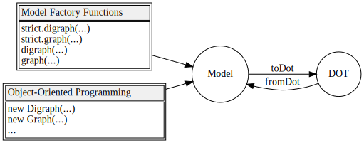

[](https://github.com/kamiazya/ts-graphviz/actions?workflow=NodeCI)
[](https://badge.fury.io/js/ts-graphviz)
[](https://opensource.org/licenses/MIT)
[](http://makeapullrequest.com)
[](https://github.com/facebook/jest)
[](https://github.com/facebook/jest)


[](#contributors)

# ts-graphviz

[Graphviz](https://graphviz.gitlab.io/) library for TypeScript.

[](https://github.com/ts-graphviz/ts-graphviz)
[](https://www.npmjs.com/package/ts-graphviz)
[](https://github.com/ts-graphviz/ts-graphviz)
[](https://ts-graphviz.github.io/ts-graphviz/)
[](https://github.com/sponsors/kamiazya)

> [English](https://github.com/ts-graphviz/ts-graphviz/blob/main/README.md) | [日本語](https://github.com/ts-graphviz/ts-graphviz/blob/main/README.ja.md)

## Key Features ✨

`ts-graphviz` package provides models and ASTs for the Graphviz DOT language fully integrated with TypeScript.

- **TypeScript-friendly API**
  - It provides models in the DOT language. TypeScript type definitions are also provided for attributes and even attribute types.
- **Freedom from programming paradigms**
  - Designed to be object-oriented, it provides APIs that can be adapted to both imperative and declarative APIs. You can choose the paradigm that best fits your project.
- **Suitable for any use cases**
  - Both a high-layer API to provide models and a low-layer API to handle ASTs are provided to address any use cases.

## Installation 💽

This package can then be installed using a package manager.

```bash
# npm
$ npm install -S ts-graphviz
# or yarn
$ yarn add ts-graphviz
# or pnpm
$ pnpm add ts-graphviz
```

## Usage 📑

This section provides an overview of the package.

For more detailed API specifications, please refer to the comments in the TypeScript type definitions and the [document](https://ts-graphviz.github.io/ts-graphviz/) automatically generated based on them.

### `ts-graphviz` Module 🚩

This module provides **Model**, an interface for working with the DOT language in JavaScript/TypeScript.



#### Object-Oriented ❤️

**Model** is designed to be object-oriented and provides classes `Digraph`, `Graph`, `Subgraph`, `Node`, and `Edge`.

Provides a `toDot` function to convert **Model** to **DOT** (DOT language string).

```typescript
import { attribute as _, Digraph, Subgraph, Node, Edge, toDot } from 'ts-graphviz';

const G = new Digraph();
const A = new Subgraph('A');
const node1 = new Node('node1', {
  [_.color]: 'red'
});
const node2 = new Node('node2', {
  [_.color]: 'blue'
});
const edge = new Edge([node1, node2], {
  [_.label]: 'Edge Label',
  [_.color]: 'pink'
});
G.addSubgraph(A);
A.addNode(node1);
A.addNode(node2);
A.addEdge(edge);
const dot = toDot(G);
// digraph {
//   subgraph "A" {
//     "node1" [
//       color = "red",
//     ];
//     "node2" [
//       color = "blue",
//     ];
//     "node1" -> "node2" [
//       label = "Edge Label",
//       color = "pink",
//     ];
//   }
// }
```

<details>
<summary>Advanced Usage</summary>

##### Custom Class 🤖

You can also add your own implementation by inheriting from the class.

```typescript
import { Digraph, Node, Edge, EdgeTargetTuple, attribute as _, toDot } from 'ts-graphviz';

class MyCustomDigraph extends Digraph {
  constructor() {
    super('G', {
      [_.label]: 'This is Custom Digraph',
    });
  }
}
class MyCustomNode extends Node {
  constructor(id: string) {
    super(`node_${id}`, {
      [_.label]: `This is Custom Node ${id}`,
    });
  }
}

class MyCustomEdge extends Edge {
  constructor(targets: EdgeTargetTuple) {
    super(targets, {
      [_.label]: 'This is Custom Edge',
    });
  }
}

const digraph = new MyCustomDigraph();
const node1 = new MyCustomNode('A');
const node2 = new MyCustomNode('B');
const edge = new MyCustomEdge([node1, node2]);
digraph.addNode(node1);
digraph.addNode(node2);
digraph.addEdge(edge);
const dot = toDot(digraph);
// digraph "G" {
//   label = "This is Custom Digraph";
//   "node_A" [
//     label = "This is Custom Node A";
//   ];
//   "node_B" [
//     label = "This is Custom Node B";
//   ];
//   "node_A" -> "node_B" [
//     label = "This is Custom Edge";
//   ];
// }
```

##### Models Context API ( `with` method) 🧅

You can also use the _Models Context API_ to create custom classes for objects generated inside of Graph.


The `with` methods of `Digraph`, `Graph`, and `Subgraph`, which are implementations of `GraphBaseModel`, are provided to predefine custom models.

```typescript
const g = new Digraph();
g.with({
  Node: MyCustomNode,
  Edge: MyCustomEdge,
});
const a = g.createNode('A'); // MyCustomNode
const b = g.createNode('B'); // MyCustomNode
g.createEdge([a, b]); // MyCustomEdge
const dot = toDot(g);
// digraph {
//   "node_A" [
//     label = "This is Custom Node A";
//   ];
//   "node_B" [
//     label = "This is Custom Node B";
//   ];
//   "node_A" -> "node_B" [
//     label = "This is Custom Edge";
//   ];
// }
```

##### `fromDot` function ⏪

> The status of this function is ! [beta](https://img.shields.io/badge/-beta-orange).

The main scenario for using this library is to use the `toDot` function, but it also supports conversions in the reverse direction.

By converting **DOT** to **Model**, a portion of the code can be written in the DOT language.

```typescript
const G = fromDot(
  `digraph {
    node_A [
      label = "This is a Label of Node A";
    ];
  }`,
);

G.edge(['node_A', 'node_B']);

const dot = toDot(G)
// digraph {
//   "node_A" [
//     label = "This is a Label of Node A";
//   ];
//   "node_A" -> "node_B";
// }
```

</details>

#### Declarative API 😎

When creating `Graph` or `Digraph`, you can use _Model Factory_ to provide a notation more similar to the **DOT** language.

**Model** also has a declarative API, so you can consistently choose a declarative paradigm.


```typescript
import { attribute as _, digraph, toDot } from 'ts-graphviz';

 const G = digraph('G', (g) => {
  const a = g.node('aa');
  const b = g.node('bb');
  const c = g.node('cc');
  g.edge([a, b, c], {
    [_.color]: 'red'
  });
  g.subgraph('A', (A) => {
    const Aa = A.node('Aaa', {
      [_.color]: 'pink'
    });

    const Ab = A.node('Abb', {
      [_.color]: 'violet'
    });
    const Ac = A.node('Acc');
    A.edge([Aa.port('a'), Ab, Ac, 'E'], {
      [_.color]: 'red'
    });
  });
});

const dot = toDot(G);
// digraph "G" {
//   "aa";
//   "bb";
//   "cc";
//   subgraph "A" {
//     "Aaa" [
//       color = "pink",
//     ];
//     "Abb" [
//       color = "violet",
//     ];
//     "Acc";
//     "Aaa":"a" -> "Abb" -> "Acc" -> "E" [
//       color = "red",
//     ];
//   }
//   "aa" -> "bb" -> "cc" [
//     color = "red",
//   ];
// }
```

> **Note** Of course, we also provide an API for creating strict mode graphs.
>
> ```typescript
> import { strict, toDot } from 'ts-graphviz';
>
> const G = strict.graph(...);
> const dot = toDot(G);
> // strict graph {
> // }
> ```


<details>
<summary>Advanced Usage</summary>

##### Models Context API ( `withContext` function ) 💈


The `withContext` function returns a _Model Factory_ function.

This _Model Factory_ provides a means to replace `RootGraphModel` with a custom class, such as `Digraph` or `Graph`.

This API provides a way to integrate declarative APIs and custom classes.

```typescript
const { digraph } = withContext({
  Digraph: MyCustomDigraph,
  Node: MyCustomNode,
  Edge: MyCustomEdge,
});

const G = digraph((g) => {
  const a = g.node('A'); // MyCustomNode
  const b = g.node('B'); // MyCustomNode
  g.edge([a, b]); // MyCustomEdge
});
const dot = toDot(g);
// digraph "G" {
//   label = "This is Custom Digraph";
//   "node_A" [
//     label = "This is Custom Node A";
//   ];
//   "node_B" [
//     label = "This is Custom Node B";
//   ];
//   "node_A" -> "node_B" [
//     label = "This is Custom Edge";
//   ];
// }
```

</details>

### `ts-graphviz/ast` Module 🔢

> This module status is .

An API is provided to handle ASTs for advanced use.


The following functions are provided as described in the state transition diagram.

- The `fromModel` function converts **Model** to **AST**.
- The `toModel` function converts **AST** to **Model**.
- The `stringify` function converts **AST** to **DOT**.
- The `parse` function to convert from **DOT** to **AST**.

> **Note** As you can see from the above figure, the `toDot` function provided by the `ts-graphviz` package is a composite of `fromModel` and `stringify`. The `fromDot` function is a composite of `parse` and `toModel`.

Detailed usage is TODO.
Please refer to the TypeScript type definition.


<details>
<summary>The parse function and AST</summary>


```typescript
import { parse } from 'ts-graphviz/ast';

const ast = parse(`
  digraph example {
    node1 [
      label = "My Node",
    ]
  }
`);
// {
//   type: 'Dot',
//   location: {
//     start: { offset: 3, line: 2, column: 3 },
//     end: { offset: 68, line: 7, column: 1 }
//   },
//   children: [
//     {
//       id: {
//         value: 'example',
//         quoted: false,
//         type: 'Literal',
//         location: {
//           start: { offset: 11, line: 2, column: 11 },
//           end: { offset: 18, line: 2, column: 18 }
//         },
//         children: []
//       },
//       directed: true,
//       strict: false,
//       type: 'Graph',
//       location: {
//         start: { offset: 3, line: 2, column: 3 },
//         end: { offset: 67, line: 6, column: 4 }
//       },
//       children: [
//         {
//           id: {
//             value: 'node1',
//             quoted: false,
//             type: 'Literal',
//             location: {
//               start: { offset: 25, line: 3, column: 5 },
//               end: { offset: 30, line: 3, column: 10 }
//             },
//             children: []
//           },
//           type: 'Node',
//           location: {
//             start: { offset: 25, line: 3, column: 5 },
//             end: { offset: 63, line: 5, column: 6 }
//           },
//           children: [
//             {
//               key: {
//                 value: 'label',
//                 quoted: false,
//                 type: 'Literal',
//                 location: {
//                   start: { offset: 39, line: 4, column: 7 },
//                   end: { offset: 44, line: 4, column: 12 }
//                 },
//                 children: []
//               },
//               value: {
//                 value: 'My Node',
//                 quoted: true,
//                 type: 'Literal',
//                 location: {
//                   start: { offset: 47, line: 4, column: 15 },
//                   end: { offset: 56, line: 4, column: 24 }
//                 },
//                 children: []
//               },
//               location: {
//                 start: { offset: 39, line: 4, column: 7 },
//                 end: { offset: 57, line: 4, column: 25 }
//               },
//               type: 'Attribute',
//               children: []
//             }
//           ]
//         }
//       ]
//     }
//   ]
// }
```

</details>

## Related Projects 💫

Related projects can be found at [**ts-graphviz** GitHub Organization](https://github.com/ts-graphviz).

The TypeScript/JavaScript ecosystem provides a variety of OSS with the goal of making Graphviz more connected and easier to use.

## Contributors 👥

Thanks goes to these wonderful people ([emoji key](https://allcontributors.org/docs/en/emoji-key)):

<!-- ALL-CONTRIBUTORS-LIST:START - Do not remove or modify this section -->
<!-- prettier-ignore-start -->
<!-- markdownlint-disable -->
<table>
  <tbody>
    <tr>
      <td align="center"><a href="http://blog.kamiazya.tech/"><br /><sub><b>Yuki Yamazaki</b></sub></a><br /><a href="https://github.com/ts-graphviz/ts-graphviz/commits?author=kamiazya" title="Code">💻</a> <a href="https://github.com/ts-graphviz/ts-graphviz/commits?author=kamiazya" title="Tests">⚠️</a> <a href="https://github.com/ts-graphviz/ts-graphviz/commits?author=kamiazya" title="Documentation">📖</a> <a href="#ideas-kamiazya" title="Ideas, Planning, & Feedback">🤔</a></td>
      <td align="center"><a href="https://laysent.com"><br /><sub><b>LaySent</b></sub></a><br /><a href="https://github.com/ts-graphviz/ts-graphviz/issues?q=author%3Alaysent" title="Bug reports">🐛</a> <a href="https://github.com/ts-graphviz/ts-graphviz/commits?author=laysent" title="Tests">⚠️</a></td>
      <td align="center"><a href="https://github.com/elasticdotventures"><br /><sub><b>elasticdotventures</b></sub></a><br /><a href="https://github.com/ts-graphviz/ts-graphviz/commits?author=elasticdotventures" title="Documentation">📖</a></td>
      <td align="center"><a href="https://github.com/ChristianMurphy"><br /><sub><b>Christian Murphy</b></sub></a><br /><a href="https://github.com/ts-graphviz/ts-graphviz/commits?author=ChristianMurphy" title="Code">💻</a> <a href="#ideas-ChristianMurphy" title="Ideas, Planning, & Feedback">🤔</a> <a href="https://github.com/ts-graphviz/ts-graphviz/commits?author=ChristianMurphy" title="Documentation">📖</a></td>
    </tr>
  </tobdy>
</table>

<!-- markdownlint-restore -->
<!-- prettier-ignore-end -->

<!-- ALL-CONTRIBUTORS-LIST:END -->

This project follows the [all-contributors](https://github.com/all-contributors/all-contributors)
specification. Contributions of any kind welcome!

## How to Contribute 💪

The easiest way to contribute is to use the library and star [repository](https://github.com/ts-graphviz/ts-graphviz).

### Questions 💭

Feel free to ask questions on [GitHub Discussions](https://github.com/ts-graphviz/ts-graphviz/discussions).

### Report bugs / request additional features 💡

Please register at [GitHub Issues](https://github.com/ts-graphviz/ts-graphviz/issues/new/choose).

### Development / Bug Fixes 🧑‍💻

See [CONTRIBUTING.md](https://github.com/ts-graphviz/ts-graphviz/blob/main/CONTRIBUTING.md).

### Financial Support 💸

Please support core member [kamiazya](https://github.com/sponsors/kamiazya).

> **Note** Even just a dollar is enough motivation for me to develop 😊

## License ⚖️

This software is released under the MIT License, see [LICENSE](https://github.com/ts-graphviz/ts-graphviz/blob/main/LICENSE).
