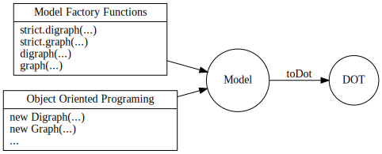
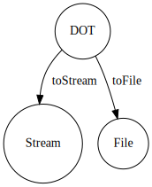
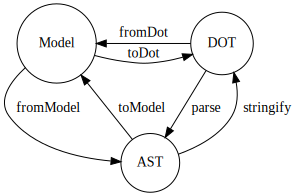

[](https://github.com/kamiazya/ts-graphviz/actions?workflow=NodeCI)
[](https://badge.fury.io/js/ts-graphviz)
[](https://opensource.org/licenses/MIT)
[](http://makeapullrequest.com)
[](https://github.com/facebook/jest)
[](https://github.com/facebook/jest)

[](https://github.com/denoland/deno)

[](#contributors)

# ts-graphviz

TypeScriptの ための [Graphviz](https://graphviz.gitlab.io/) ライブラリ

[](https://github.com/ts-graphviz/ts-graphviz)
[](https://www.npmjs.com/package/ts-graphviz)
[](https://yarnpkg.com/package/ts-graphviz)
[](https://ts-graphviz.github.io/ts-graphviz/)
[](https://github.com/sponsors/kamiazya)

> [English](https://github.com/ts-graphviz/ts-graphviz/blob/main/README.md) | [日本語](https://github.com/ts-graphviz/ts-graphviz/blob/main/README_ja.md)

## 主な機能 ✨

TypeScript に完全に統合された Graphviz DOT言語のモデルとASTを提供します。

- **TypeScript フレンドリーな API**
  - DOT言語のモデルを提供しています。また属性と属性の型まで TypeScript の型定義が用意されています。
- **パラダイムからの開放**
  - オブジェクト指向で設計され、命令的 API と 宣言的 API のどちらにも適合できるAPI提供しています。 プロジェクトにあったパラダイムを選択できます。
- **あらゆるユースケースに対応**
  - モデルを提供する高レイヤーの API と ASTを取り扱う低レイヤーの API をどちらも提供し、あらゆるユースケースに対応します。

## インストール方法 💽

### Node.js

このパッケージは、パッケージマネージャを使用してインストールすることができます。

```bash
# npm
$ npm install -S ts-graphviz
# or yarn
$ yarn add ts-graphviz
# or pnpm
$ pnpm add ts-graphviz
```

### Deno 🦕

[Deno v1.28 以上では npm をサポート](https://deno.land/manual/node/npm_specifiers)しています。

下記のように指定することで、パッケージをインストールし使用することができます。

```ts
import { toDot } from 'npm:ts-graphviz';
```

## 使い方 📑

この項では、パッケージの概要について説明します。

より詳細なAPIの仕様は、 TypeScript の型定義のコメントやそれを元に自動生成された [ドキュメント](https://ts-graphviz.github.io/ts-graphviz/) を参照してください。

### `ts-graphviz` モジュール 🚩

DOT 言語をJavaScript/TypeScriptで扱うためのインターフェースである Model を提供します。



#### オブジェクト指向 ❤️

**Model** はオブジェクト指向に設計されており、 `Digraph`, `Graph`, `Subgraph`, `Node`, `Edge` のクラスを提供しています。

**Model** を **DOT** (DOT言語の文字列)に変換する`toDot` 関数を提供しています。

```typescript
import { attribute as _, Digraph, Subgraph, Node, Edge, toDot } from 'ts-graphviz';

const G = new Digraph();
const A = new Subgraph('A');
const node1 = new Node('node1', {
  [_.color]: 'red'
});
const node2 = new Node('node2', {
  [_.color]: 'blue'
});
const edge = new Edge([node1, node2], {
  [_.label]: 'Edge Label',
  [_.color]: 'pink'
});
G.addSubgraph(A);
A.addNode(node1);
A.addNode(node2);
A.addEdge(edge);
const dot = toDot(G);
// digraph {
//   subgraph "A" {
//     "node1" [
//       color = "red",
//     ];
//     "node2" [
//       color = "blue",
//     ];
//     "node1" -> "node2" [
//       label = "Edge Label",
//       color = "pink",
//     ];
//   }
// }
```

<details>
<summary>高度な使い方</summary>

##### カスタム・クラス 🤖

クラスを継承することで独自の実装を加えることもできます。

```typescript
import { Digraph, Node, Edge, EdgeTargetTuple, attribute as _, toDot } from 'ts-graphviz';

class MyCustomDigraph extends Digraph {
  constructor() {
    super('G', {
      [_.label]: 'This is Custom Digraph',
    });
  }
}
class MyCustomNode extends Node {
  constructor(id: string) {
    super(`node_${id}`, {
      [_.label]: `This is Custom Node ${id}`,
    });
  }
}

class MyCustomEdge extends Edge {
  constructor(targets: EdgeTargetTuple) {
    super(targets, {
      [_.label]: 'This is Custom Edge',
    });
  }
}

const digraph = new MyCustomDigraph();
const node1 = new MyCustomNode('A');
const node2 = new MyCustomNode('B');
const edge = new MyCustomEdge([node1, node2]);
digraph.addNode(node1);
digraph.addNode(node2);
digraph.addEdge(edge);
const dot = toDot(digraph);
// digraph "G" {
//   label = "This is Custom Digraph";
//   "node_A" [
//     label = "This is Custom Node A";
//   ];
//   "node_B" [
//     label = "This is Custom Node B";
//   ];
//   "node_A" -> "node_B" [
//     label = "This is Custom Edge";
//   ];
// }
```

##### Models Context API ( `with` メソッド) 🧅

あなたは _Models Context API_ をつかうことで、Graphの内部で生成されるオブジェクトもカスタムクラスにすることができます。


`GraphBaseModel` の実装である `Digraph`, `Graph`, `Subgraph` が持つ `with` メソッドは、 カスタムモデルを事前定義するために提供されています。

```typescript
const g = new Digraph();
g.with({
  Node: MyCustomNode,
  Edge: MyCustomEdge,
});
const a = g.createNode('A'); // MyCustomNode
const b = g.createNode('B'); // MyCustomNode
g.createEdge([a, b]); // MyCustomEdge
const dot = toDot(g);
// digraph {
//   "node_A" [
//     label = "This is Custom Node A";
//   ];
//   "node_B" [
//     label = "This is Custom Node B";
//   ];
//   "node_A" -> "node_B" [
//     label = "This is Custom Edge";
//   ];
// }
```

##### `fromDot` 関数 ⏪

> この関数のステータスは  です。

このライブラリを使用するメインシナリオは `toDot` 関数を使用することにありますが、逆方向の変換もサポートしています。

**DOT** を **Model** に変換により、コードの一部をDOT言語で記述することができます。


```typescript
const G = fromDot(
  `digraph {
    node_A [
      label = "This is a Label of Node A";
    ];
  }`,
);

G.edge(['node_A', 'node_B']);

const dot = toDot(G)
// digraph {
//   "node_A" [
//     label = "This is a Label of Node A";
//   ];
//   "node_A" -> "node_B";
// }
```

</details>


#### 宣言的な API 😎

`Graph` や `Digraph` を作成する際に、より **DOT** 言語に近い記法を提供するために _Model Factory_ を使うことができます。

**Model** にも宣言的な API を用意しており、一貫して宣言的なパラダイムを選択することもできます。

```typescript
import { attribute as _, digraph, toDot } from 'ts-graphviz';

 const G = digraph('G', (g) => {
  const a = g.node('aa');
  const b = g.node('bb');
  const c = g.node('cc');
  g.edge([a, b, c], {
    [_.color]: 'red'
  });
  g.subgraph('A', (A) => {
    const Aa = A.node('Aaa', {
      [_.color]: 'pink'
    });

    const Ab = A.node('Abb', {
      [_.color]: 'violet'
    });
    const Ac = A.node('Acc');
    A.edge([Aa.port('a'), Ab, Ac, 'E'], {
      [_.color]: 'red'
    });
  });
});

const dot = toDot(G);
// digraph "G" {
//   "aa";
//   "bb";
//   "cc";
//   subgraph "A" {
//     "Aaa" [
//       color = "pink",
//     ];
//     "Abb" [
//       color = "violet",
//     ];
//     "Acc";
//     "Aaa":"a" -> "Abb" -> "Acc" -> "E" [
//       color = "red",
//     ];
//   }
//   "aa" -> "bb" -> "cc" [
//     color = "red",
//   ];
// }
```

> **Note** もちろん、strictモードのグラフを作るAPIも提供しています。
>
> ```typescript
> import { strict, toDot } from 'ts-graphviz';
>
> const G = strict.graph(...);
> const dot = toDot(G);
> // strict graph {
> // }
> ```


<details>
<summary>高度な使い方</summary>

##### Models Context API ( `withContext` 関数 ) 💈


`withContext` 関数は、 _Model Factory_ 関数を返します。

この _Model Factory_ は、 `Digraph` や `Graph` など、 `RootGraphModel` をカスタムクラスに置き換える手段を提供します。

これのAPIにより、宣言的APIとカスタムクラスを統合する手段を提供します。

```typescript
const { digraph } = withContext({
  Digraph: MyCustomDigraph,
  Node: MyCustomNode,
  Edge: MyCustomEdge,
});

const G = digraph((g) => {
  const a = g.node('A'); // MyCustomNode
  const b = g.node('B'); // MyCustomNode
  g.edge([a, b]); // MyCustomEdge
});
const dot = toDot(g);
// digraph "G" {
//   label = "This is Custom Digraph";
//   "node_A" [
//     label = "This is Custom Node A";
//   ];
//   "node_B" [
//     label = "This is Custom Node B";
//   ];
//   "node_A" -> "node_B" [
//     label = "This is Custom Edge";
//   ];
// }
```

</details>

### `ts-graphviz/adapter` モジュール 🔌

> このモジュールのステータスは  です。

Graphviz の dot コマンドを実行するためのインターフェースを提供しています。

[Graphviz](https://graphviz.gitlab.io/) をインストールし、 dot コマンドを実行できるようにしてください。

dot コマンドを実行し、 DOT 言語の文字列を Stream やファイルに出力します。



このモジュールでは、下記の関数を提供しています。

- **DOT** を **Stream** に変換する `toStream` 関数
    ```ts
    import { toStream } from 'ts-graphviz/adapter';

    const dot = `
      digraph example {
        node1 [
          label = "My Node",
        ]
      }
    `;

    const stream = await toStream(dot, { format: 'svg' });
    // Node.js
    stream.pipe(process.stdout);
    // Deno
    await stream.pipeTo(Deno.stdout.writable);
    ```

- **DOT** を指定したパスのファイルに書き出す `toFile` 関数
    ```ts
    import { toFile } from 'ts-graphviz/adapter';

    const dot = `
      digraph example {
        node1 [
          label = "My Node",
        ]
      }
    `;

    await toFile(dot, './result.svg', { format: 'svg' });
    ```

Node.js と Deno で動作するように設計されており、 Stream はランタイムネイティブです。


### `ts-graphviz/ast` モジュール 🔢

> このモジュールのステータスは  です。

高度な利用のためにASTを扱うためのAPIを提供しています。



状態遷移図で記載している通り、下記の関数を提供しています。

- **Model** から **AST** に変換する `fromModel` 関数
- **AST** から **Model** に変換する `toModel` 関数
- **AST** から **DOT** に変換する `stringify` 関数
- **DOT** から **AST** に変換する `parse` 関数

> **Note** 上記の図からわかるように、`ts-graphviz` パッケージで提供している `toDot` 関数は、 `fromModel` と `stringify` の合成関数です。また、`fromDot` 関数は、 `parse` と `toModel` の合成関数です。

詳しい利用方法は整備中です。
TypeScriptの型定義を参考にしてください。

<details>
<summary>parse 関数とAST</summary>


```typescript
import { parse } from 'ts-graphviz/ast';

const ast = parse(`
  digraph example {
    node1 [
      label = "My Node",
    ]
  }
`);
// {
//   type: 'Dot',
//   location: {
//     start: { offset: 3, line: 2, column: 3 },
//     end: { offset: 68, line: 7, column: 1 }
//   },
//   children: [
//     {
//       id: {
//         value: 'example',
//         quoted: false,
//         type: 'Literal',
//         location: {
//           start: { offset: 11, line: 2, column: 11 },
//           end: { offset: 18, line: 2, column: 18 }
//         },
//         children: []
//       },
//       directed: true,
//       strict: false,
//       type: 'Graph',
//       location: {
//         start: { offset: 3, line: 2, column: 3 },
//         end: { offset: 67, line: 6, column: 4 }
//       },
//       children: [
//         {
//           id: {
//             value: 'node1',
//             quoted: false,
//             type: 'Literal',
//             location: {
//               start: { offset: 25, line: 3, column: 5 },
//               end: { offset: 30, line: 3, column: 10 }
//             },
//             children: []
//           },
//           type: 'Node',
//           location: {
//             start: { offset: 25, line: 3, column: 5 },
//             end: { offset: 63, line: 5, column: 6 }
//           },
//           children: [
//             {
//               key: {
//                 value: 'label',
//                 quoted: false,
//                 type: 'Literal',
//                 location: {
//                   start: { offset: 39, line: 4, column: 7 },
//                   end: { offset: 44, line: 4, column: 12 }
//                 },
//                 children: []
//               },
//               value: {
//                 value: 'My Node',
//                 quoted: true,
//                 type: 'Literal',
//                 location: {
//                   start: { offset: 47, line: 4, column: 15 },
//                   end: { offset: 56, line: 4, column: 24 }
//                 },
//                 children: []
//               },
//               location: {
//                 start: { offset: 39, line: 4, column: 7 },
//                 end: { offset: 57, line: 4, column: 25 }
//               },
//               type: 'Attribute',
//               children: []
//             }
//           ]
//         }
//       ]
//     }
//   ]
// }
```

</details>

## 誰が使っているか 📜

- [Apollo GraphQL](https://github.com/apollographql)
- [AWS](https://github.com/aws)
- [IBM (StrongLoop)](https://strongloop.com)
- [The University of Tokyo](https://github.com/csg-tokyo)
- [Transmute](https://github.com/transmute-industries)

> **Note** 他に知っていたら [GitHub Discussions](https://github.com/ts-graphviz/ts-graphviz/discussions/736) で教えてください 🙏

## 関連プロジェクト 💫

関連するプロジェクトは [**ts-graphviz** GitHub Organization](https://github.com/ts-graphviz) で確認することができます。

TypeScript/JavaScript エコシステムで Graphviz との結合度を高め、より使いやすくすることを目的に様々な OSS を提供しています。

## コントリビュータ 👥

この素晴らしい人たち（[emoji key](https://allcontributors.org/docs/en/emoji-key)）に感謝します。

<!-- ALL-CONTRIBUTORS-LIST:START - Do not remove or modify this section -->
<!-- prettier-ignore-start -->
<!-- markdownlint-disable -->
<table>
  <tbody>
    <tr>
      <td align="center"><a href="http://blog.kamiazya.tech/"><br /><sub><b>Yuki Yamazaki</b></sub></a><br /><a href="https://github.com/ts-graphviz/ts-graphviz/commits?author=kamiazya" title="Code">💻</a> <a href="https://github.com/ts-graphviz/ts-graphviz/commits?author=kamiazya" title="Tests">⚠️</a> <a href="https://github.com/ts-graphviz/ts-graphviz/commits?author=kamiazya" title="Documentation">📖</a> <a href="#ideas-kamiazya" title="Ideas, Planning, & Feedback">🤔</a></td>
      <td align="center"><a href="https://laysent.com"><br /><sub><b>LaySent</b></sub></a><br /><a href="https://github.com/ts-graphviz/ts-graphviz/issues?q=author%3Alaysent" title="Bug reports">🐛</a> <a href="https://github.com/ts-graphviz/ts-graphviz/commits?author=laysent" title="Tests">⚠️</a></td>
      <td align="center"><a href="https://github.com/elasticdotventures"><br /><sub><b>elasticdotventures</b></sub></a><br /><a href="https://github.com/ts-graphviz/ts-graphviz/commits?author=elasticdotventures" title="Documentation">📖</a></td>
      <td align="center"><a href="https://github.com/ChristianMurphy"><br /><sub><b>Christian Murphy</b></sub></a><br /><a href="https://github.com/ts-graphviz/ts-graphviz/commits?author=ChristianMurphy" title="Code">💻</a> <a href="#ideas-ChristianMurphy" title="Ideas, Planning, & Feedback">🤔</a> <a href="https://github.com/ts-graphviz/ts-graphviz/commits?author=ChristianMurphy" title="Documentation">📖</a></td>
      <td align="center"><a href="https://github.com/ArtemAdamenko"><br /><sub><b>Artem</b></sub></a><br /><a href="https://github.com/ts-graphviz/ts-graphviz/issues?q=author%3AArtemAdamenko" title="Bug reports">🐛</a></td>
      <td align="center"><a href="https://github.com/fredericohpandolfo"><br /><sub><b>fredericohpandolfo</b></sub></a><br /><a href="https://github.com/ts-graphviz/ts-graphviz/issues?q=author%3Afredericohpandolfo" title="Bug reports">🐛</a></td>
      <td align="center"><a href="https://github.com/diegoquinteiro"><br /><sub><b>diegoquinteiro</b></sub></a><br /><a href="https://github.com/ts-graphviz/ts-graphviz/issues?q=author%3Adiegoquinteiro" title="Bug reports">🐛</a></td>
    </tr>
  </tbody>
</table>

<!-- markdownlint-restore -->
<!-- prettier-ignore-end -->

<!-- ALL-CONTRIBUTORS-LIST:END -->

このプロジェクトは、[all-contributors](https://github.com/all-contributors/all-contributors) の仕様に準拠しています。

どのような種類の貢献でも歓迎します。

## 貢献の方法 💪

一番簡単な貢献の方法は、ライブラリを使っていただくことと、 [リポジトリ](https://github.com/ts-graphviz/ts-graphviz) にスターをつけることです。

### 質問 💭

[GitHub Discussions](https://github.com/ts-graphviz/ts-graphviz/discussions) で気軽に質問してください。

### バグの報告/追加機能の要望 💡

[GitHub Issues](https://github.com/ts-graphviz/ts-graphviz/issues/new/choose) から登録してください。

### 機能開発/バグ修正 🧑‍💻

[CONTRIBUTING.md](https://github.com/ts-graphviz/ts-graphviz/blob/main/CONTRIBUTING.md) を参照してください。

### 金銭的支援 💸

コアメンバーの [kamiazya](https://github.com/sponsors/kamiazya) を支援してください。

> **Note** たった1ドルでも、私には十分な開発のモチベーションになります 😊

## ライセンス ⚖️

本ソフトウェアはMITライセンスのもとで公開されています。
[LICENSE](https://github.com/ts-graphviz/ts-graphviz/blob/main/LICENSE)を参照してください。
