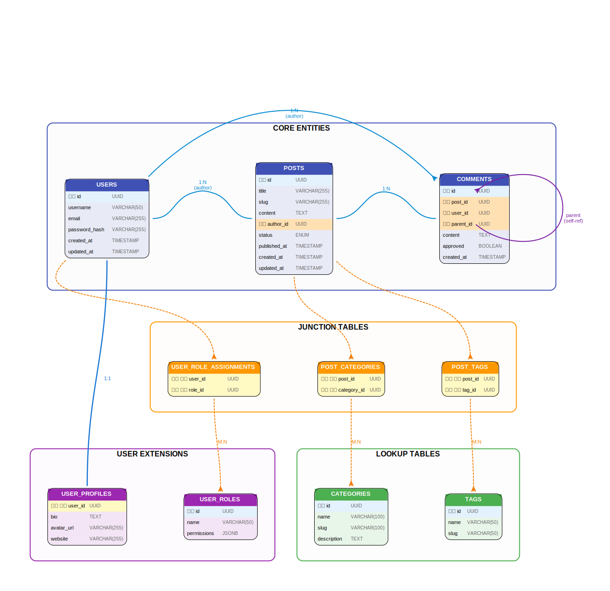

# Entity Relationship Diagram (ERD) - Blog Platform

A comprehensive example demonstrating how to generate Entity Relationship Diagrams for database schemas using ts-graphviz.

## Overview

This example visualizes a blog platform database schema with multiple entity types, relationships, and database design patterns commonly used in real-world applications.

## Database Schema

### Core Entities
- **users**: User accounts with authentication
- **posts**: Blog posts with content and metadata
- **comments**: User comments on posts (supports nested replies)

### Lookup Tables
- **categories**: Post categorization
- **tags**: Post tagging system

### Junction Tables
- **post_categories**: Many-to-many relationship between posts and categories
- **post_tags**: Many-to-many relationship between posts and tags
- **user_role_assignments**: Many-to-many relationship between users and roles

### Extension Tables
- **user_profiles**: Extended user information (1:1 with users)
- **user_roles**: Role-based access control

## Relationship Types Demonstrated

| Type | Example | Description |
|------|---------|-------------|
| **1:1** | users ↔ user_profiles | One-to-one relationship |
| **1:N** | users → posts | One-to-many relationship |
| **M:N** | posts ↔ categories | Many-to-many via junction table |
| **Self-ref** | comments → comments | Self-referential for nested replies |

## Visual Features

- **Color-coded tables** by type:
  - 🔵 Blue: Core entities
  - 🟠 Orange: Junction tables
  - 🟢 Green: Lookup tables
  - 🟣 Purple: User extensions

- **Key indicators**:
  - 𝙋𝙆: Primary Key (blue background)
  - 𝙁𝙆: Foreign Key (orange background)
  - 𝙁𝙆 𝙋𝙆: Composite key (yellow background)

- **Relationship styling**:
  - Solid lines: Direct relationships
  - Dashed lines: Many-to-many via junction
  - Crow's foot notation for cardinality

## Usage

```bash
# Install dependencies
npm install

# Generate the ERD
npm run generate

# Or run directly
ts-node index.ts

# Generate SVG output
dot -Tsvg blog-platform-erd.dot -o blog-platform-erd.svg

# Generate PNG output
dot -Tpng -Gdpi=96 blog-platform-erd.dot -o blog-platform-erd.png
```

## Output



## Database Design Patterns

### Normalization
- All tables follow 3NF (Third Normal Form)
- No redundant data storage
- Proper use of foreign keys

### Junction Tables
Used for many-to-many relationships:
- `post_categories`: Links posts to multiple categories
- `post_tags`: Links posts to multiple tags
- `user_role_assignments`: Links users to multiple roles

### Extension Pattern
`user_profiles` demonstrates the 1:1 extension pattern, separating frequently accessed data (users) from optional profile information.

## Customization

You can customize the ERD by:

1. **Adding new tables**: Use the `createTableNode()` function
2. **Changing colors**: Modify the `COLORS` constant
3. **Adjusting layout**: Change `rankdir`, `nodesep`, `ranksep` values
4. **Adding relationships**: Use `g.edge()` with appropriate styling

## Learn More

- [ts-graphviz Documentation](https://ts-graphviz.github.io/)
- [Database Normalization](https://en.wikipedia.org/wiki/Database_normalization)
- [ERD Best Practices](https://www.lucidchart.com/pages/er-diagrams)
