<div align="center">

[](https://github.com/ts-graphviz/ts-graphviz/actions/workflows/main.yaml)
[](https://github.com/ts-graphviz/ts-graphviz/actions/workflows/codeql-analysis.yml)
[](https://github.com/ts-graphviz/ts-graphviz/blob/main/LICENSE)
[](#contributors-)

[](https://www.bestpractices.dev/projects/8396)
[](https://scorecard.dev/viewer/?uri=github.com/ts-graphviz/ts-graphviz)
[](https://tidelift.com/subscription/pkg/npm-ts-graphviz?utm_source=npm-ts-graphviz&utm_medium=readme)

[](https://badge.fury.io/js/ts-graphviz)

[](https://github.com/denoland/deno)
[](https://npmtrends.com/ts-graphviz)

# @ts-graphviz/adapter

Cross-platform interfaces for executing Graphviz DOT commands in various JavaScript runtimes.

🔗

[](https://github.com/ts-graphviz/ts-graphviz)
[](https://www.npmjs.com/package/ts-graphviz)
[](https://ts-graphviz.github.io/ts-graphviz/)
[](https://deepwiki.com/ts-graphviz/ts-graphviz)

[](https://github.com/sponsors/ts-graphviz)
[](https://opencollective.com/ts-graphviz)

[](https://biomejs.dev/)
[](https://vitest.dev/)
[](https://rollupjs.org/)

</div>

---

> It is part of the ts-graphviz library, which is split into modular packages to improve maintainability, flexibility, and ease of use.

This library enables rendering DOT language strings into different output formats through platform-specific implementations for Node.js, and Deno.

[Graphviz](https://graphviz.gitlab.io/) must be installed so that the dot command can be executed.

Execute the dot command to output a DOT language string to a stream or file.


## Core Functions

The adapter provides two main functions for working with DOT language strings:

### `toStream`

The `toStream` function converts a DOT language string to a readable stream of the specified output format.


```ts
import { toStream } from '@ts-graphviz/adapter';

const dot = `
  digraph example {
    node1 [
      label = "My Node",
    ]
  }
`;

const stream = await toStream(dot, { format: 'svg' });
// Node.js
stream.pipe(process.stdout);
// Deno
await stream.pipeTo(Deno.stdout.writable);
```

### `toFile`

The `toFile` function writes the rendered output directly to a file at the specified path.

```ts
import { toFile } from '@ts-graphviz/adapter';

const dot = `
  digraph example {
    node1 [
      label = "My Node",
    ]
  }
`;

await toFile(dot, './result.svg', { format: 'svg' });
```

Both functions accept configuration options to customize the rendering process.

## Configuration Options

### Security Considerations

The `dotCommand` and `library` options are intended to be configured by application developers, not derived from end-user input:

- **`dotCommand`**: Specifies the path to the Graphviz executable. This should be a trusted, hardcoded path in your application configuration.
- **`library`**: Specifies external libraries to load. These should be trusted library names defined in your application code.

**Important**: This library executes external commands using `spawn` (Node.js) or `Deno.Command` (Deno), which do not invoke a shell interpreter. This prevents shell injection attacks through metacharacters (`;`, `` ` ``, `|`, `$`, etc.). However, these options should not be exposed to end-user input.

#### Processing User-Provided DOT Files

When rendering DOT files uploaded by users or generated from user input, implement validation before passing them to this library:

**Validation Steps**:
1. **Syntax validation**: Verify the DOT file is well-formed and parseable
2. **Attribute filtering**: Check for potentially dangerous attributes that reference file system resources:
   - `image`, `shapefile` - Can reference arbitrary image files
   - `fontpath`, `fontname` - Can reference font files
   - `imagepath` - Defines search path for images
3. **Content sanitization**: Consider using a DOT parser to rebuild the graph with only allowed attributes
4. **Sandboxing**: Run Graphviz in a sandboxed environment with restricted file system access when processing untrusted input

**Example Risk Scenario**:

⚠️ **Warning**: The following is an example of **unsafe** DOT content that should be rejected by validation:

```dot
digraph G {
  node [image="/etc/passwd"];  // ⚠️ DANGEROUS: Attempts to access sensitive file
  node1;
}
```



While Graphviz will handle file access errors gracefully, processing untrusted DOT files without validation may expose information about your file system or cause unexpected behavior. **Always validate and sanitize user-provided DOT files before processing.**

**Example: Validating and Sanitizing User-Provided DOT Files**

Here's an example of how to use the `@ts-graphviz/ast` package to parse, validate, and sanitize DOT files:

```typescript
import { parse, stringify } from '@ts-graphviz/ast';

// Potentially dangerous attributes that can access file system
const DANGEROUS_ATTRIBUTES = new Set([
  'image',
  'shapefile',
  'fontpath',
  'fontname',
  'imagepath',
]);

/**
 * Validates and sanitizes a DOT file by removing dangerous attributes
 */
function validateAndSanitizeDOT(dotString: string): string {
  try {
    // Parse the DOT string into an AST
    const ast = parse(dotString);

    // Remove dangerous attributes from the AST
    sanitizeAST(ast);

    // Convert back to DOT string
    return stringify(ast);
  } catch (error) {
    throw new Error(`Invalid DOT syntax: ${error.message}`);
  }
}

/**
 * Recursively sanitize AST nodes by removing dangerous attributes
 */
function sanitizeAST(node: any): void {
  if (!node || typeof node !== 'object') return;

  // Handle nodes with children
  if (Array.isArray(node.children)) {
    node.children = node.children.filter((child: any) => {
      // Filter out dangerous attribute nodes
      if (child.type === 'Attribute') {
        const attributeName = child.key?.value;
        if (DANGEROUS_ATTRIBUTES.has(attributeName)) {
          console.warn(`Removed dangerous attribute: ${attributeName}`);
          return false;
        }
      }
      // Recursively sanitize child nodes
      sanitizeAST(child);
      return true;
    });
  }
}

// Usage example
const userUploadedDOT = `
  digraph G {
    node [image="/etc/passwd"];
    node1 [label="Safe label"];
  }
`;

const sanitizedDOT = validateAndSanitizeDOT(userUploadedDOT);
// Result: digraph G { node1 [label="Safe label"]; }
```

**Best Practices**:
- Use the default `dot` command when possible
- If you need to customize `dotCommand`, use a hardcoded path or environment variable controlled by the deployment environment
- Do not allow end-user input to control the configuration options
- Validate and sanitize DOT strings from untrusted sources before rendering
- Consider using a whitelist approach for allowed attributes when processing user-provided DOT files
- Run Graphviz in a restricted environment when handling untrusted input

## Contributors 👥

Thanks goes to these wonderful people ([emoji key](https://allcontributors.org/docs/en/emoji-key)):

<!-- ALL-CONTRIBUTORS-LIST:START - Do not remove or modify this section -->
<!-- prettier-ignore-start -->
<!-- markdownlint-disable -->
<table>
  <tbody>
    <tr>
      <td align="center" valign="top" width="14.28%"><a href="http://blog.kamiazya.tech/"><br /><sub><b>Yuki Yamazaki</b></sub></a><br /><a href="https://github.com/ts-graphviz/ts-graphviz/commits?author=kamiazya" title="Code">💻</a> <a href="https://github.com/ts-graphviz/ts-graphviz/commits?author=kamiazya" title="Tests">⚠️</a> <a href="https://github.com/ts-graphviz/ts-graphviz/commits?author=kamiazya" title="Documentation">📖</a> <a href="#ideas-kamiazya" title="Ideas, Planning, & Feedback">🤔</a></td>
      <td align="center" valign="top" width="14.28%"><a href="https://laysent.com"><br /><sub><b>LaySent</b></sub></a><br /><a href="https://github.com/ts-graphviz/ts-graphviz/issues?q=author%3Alaysent" title="Bug reports">🐛</a> <a href="https://github.com/ts-graphviz/ts-graphviz/commits?author=laysent" title="Tests">⚠️</a></td>
      <td align="center" valign="top" width="14.28%"><a href="https://github.com/elasticdotventures"><br /><sub><b>elasticdotventures</b></sub></a><br /><a href="https://github.com/ts-graphviz/ts-graphviz/commits?author=elasticdotventures" title="Documentation">📖</a></td>
      <td align="center" valign="top" width="14.28%"><a href="https://github.com/ChristianMurphy"><br /><sub><b>Christian Murphy</b></sub></a><br /><a href="https://github.com/ts-graphviz/ts-graphviz/commits?author=ChristianMurphy" title="Code">💻</a> <a href="#ideas-ChristianMurphy" title="Ideas, Planning, & Feedback">🤔</a> <a href="https://github.com/ts-graphviz/ts-graphviz/commits?author=ChristianMurphy" title="Documentation">📖</a></td>
      <td align="center" valign="top" width="14.28%"><a href="https://github.com/ArtemAdamenko"><br /><sub><b>Artem</b></sub></a><br /><a href="https://github.com/ts-graphviz/ts-graphviz/issues?q=author%3AArtemAdamenko" title="Bug reports">🐛</a></td>
      <td align="center" valign="top" width="14.28%"><a href="https://github.com/fredericohpandolfo"><br /><sub><b>fredericohpandolfo</b></sub></a><br /><a href="https://github.com/ts-graphviz/ts-graphviz/issues?q=author%3Afredericohpandolfo" title="Bug reports">🐛</a></td>
      <td align="center" valign="top" width="14.28%"><a href="https://github.com/diegoquinteiro"><br /><sub><b>diegoquinteiro</b></sub></a><br /><a href="https://github.com/ts-graphviz/ts-graphviz/issues?q=author%3Adiegoquinteiro" title="Bug reports">🐛</a></td>
    </tr>
    <tr>
      <td align="center" valign="top" width="14.28%"><a href="https://github.com/robross0606"><br /><sub><b>robross0606</b></sub></a><br /><a href="#ideas-robross0606" title="Ideas, Planning, & Feedback">🤔</a></td>
      <td align="center" valign="top" width="14.28%"><a href="https://blake-regalia.net"><br /><sub><b>Blake Regalia</b></sub></a><br /><a href="https://github.com/ts-graphviz/ts-graphviz/issues?q=author%3Ablake-regalia" title="Bug reports">🐛</a></td>
      <td align="center" valign="top" width="14.28%"><a href="https://github.com/bigbug"><br /><sub><b>bigbug</b></sub></a><br /><a href="#question-bigbug" title="Answering Questions">💬</a></td>
      <td align="center" valign="top" width="14.28%"><a href="https://github.com/murawakimitsuhiro"><br /><sub><b>mrwk</b></sub></a><br /><a href="#question-murawakimitsuhiro" title="Answering Questions">💬</a></td>
      <td align="center" valign="top" width="14.28%"><a href="https://github.com/svdvonde"><br /><sub><b>svdvonde</b></sub></a><br /><a href="#question-svdvonde" title="Answering Questions">💬</a></td>
      <td align="center" valign="top" width="14.28%"><a href="https://github.com/seethroughdev"><br /><sub><b>Adam</b></sub></a><br /><a href="#question-seethroughdev" title="Answering Questions">💬</a></td>
      <td align="center" valign="top" width="14.28%"><a href="https://github.com/trevor-scheer"><br /><sub><b>Trevor Scheer</b></sub></a><br /><a href="#a11y-trevor-scheer" title="Accessibility">️️️️♿️</a></td>
    </tr>
    <tr>
      <td align="center" valign="top" width="14.28%"><a href="https://pre.ms"><br /><sub><b>Prem Pillai</b></sub></a><br /><a href="https://github.com/ts-graphviz/ts-graphviz/issues?q=author%3Acloud-on-prem" title="Bug reports">🐛</a></td>
      <td align="center" valign="top" width="14.28%"><a href="https://github.com/nagasawaryoya"><br /><sub><b>nagasawaryoya</b></sub></a><br /><a href="https://github.com/ts-graphviz/ts-graphviz/commits?author=nagasawaryoya" title="Code">💻</a> <a href="https://github.com/ts-graphviz/ts-graphviz/commits?author=nagasawaryoya" title="Tests">⚠️</a></td>
      <td align="center" valign="top" width="14.28%"><a href="https://github.com/tokidrill"><br /><sub><b>YukiSasaki</b></sub></a><br /><a href="https://github.com/ts-graphviz/ts-graphviz/commits?author=tokidrill" title="Code">💻</a> <a href="https://github.com/ts-graphviz/ts-graphviz/commits?author=tokidrill" title="Tests">⚠️</a></td>
      <td align="center" valign="top" width="14.28%"><a href="https://github.com/Madd0g"><br /><sub><b>Madd0g</b></sub></a><br /><a href="https://github.com/ts-graphviz/ts-graphviz/issues?q=author%3AMadd0g" title="Bug reports">🐛</a></td>
      <td align="center" valign="top" width="14.28%"><a href="https://github.com/j4k0xb"><br /><sub><b>j4k0xb</b></sub></a><br /><a href="https://github.com/ts-graphviz/ts-graphviz/issues?q=author%3Aj4k0xb" title="Bug reports">🐛</a></td>
      <td align="center" valign="top" width="14.28%"><a href="https://github.com/haved"><br /><sub><b>HKrogstie</b></sub></a><br /><a href="https://github.com/ts-graphviz/ts-graphviz/issues?q=author%3Ahaved" title="Bug reports">🐛</a></td>
      <td align="center" valign="top" width="14.28%"><a href="https://github.com/septatrix"><br /><sub><b>Nils K</b></sub></a><br /><a href="https://github.com/ts-graphviz/ts-graphviz/issues?q=author%3Aseptatrix" title="Bug reports">🐛</a></td>
    </tr>
    <tr>
      <td align="center" valign="top" width="14.28%"><a href="https://github.com/hao2013"><br /><sub><b>hao2013</b></sub></a><br /><a href="#maintenance-hao2013" title="Maintenance">🚧</a> <a href="https://github.com/ts-graphviz/ts-graphviz/pulls?q=is%3Apr+reviewed-by%3Ahao2013" title="Reviewed Pull Requests">👀</a></td>
      <td align="center" valign="top" width="14.28%"><a href="http://www.walterra.dev"><br /><sub><b>Walter Rafelsberger</b></sub></a><br /><a href="#question-walterra" title="Answering Questions">💬</a></td>
      <td align="center" valign="top" width="14.28%"><a href="https://github.com/grsjst"><br /><sub><b>grsjst</b></sub></a><br /><a href="https://github.com/ts-graphviz/ts-graphviz/issues?q=author%3Agrsjst" title="Bug reports">🐛</a></td>
      <td align="center" valign="top" width="14.28%"><a href="https://github.com/stephenirven"><br /><sub><b>Steve</b></sub></a><br /><a href="https://github.com/ts-graphviz/ts-graphviz/issues?q=author%3Astephenirven" title="Bug reports">🐛</a></td>
    </tr>
  </tbody>
</table>

<!-- markdownlint-restore -->
<!-- prettier-ignore-end -->

<!-- ALL-CONTRIBUTORS-LIST:END -->

This project follows the [all-contributors](https://github.com/all-contributors/all-contributors)
specification. Contributions of any kind welcome!

## Changelog 📜

See [CHANGELOG.md](https://github.com/ts-graphviz/ts-graphviz/blob/main/packages/adapter/CHANGELOG.md) for more details.

## License ⚖️

This software is released under the MIT License, see [LICENSE](https://github.com/ts-graphviz/ts-graphviz/blob/main/LICENSE).
