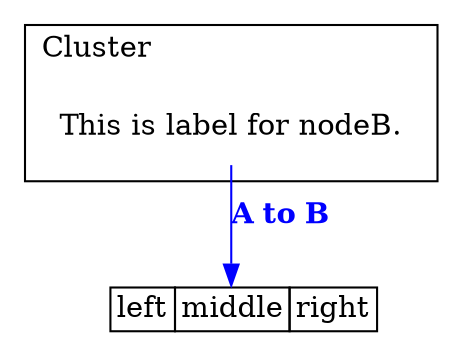
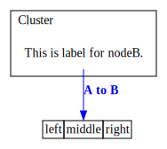

# @ts-graphviz/react

Graphviz-dot Renderer for React.

## Installation

The module can then be installed using [npm](https://www.npmjs.com/):

[](https://nodei.co/npm/@ts-graphviz/react/)

```bash
# yarn
$ yarn add @ts-graphviz/react
# or npm
$ npm install @ts-graphviz/react
```

### Peer Dependencies

- [React](https://github.com/facebook/react/)(>=16.8)
- [ts-graphviz](https://github.com/ts-graphviz/ts-graphviz)

```bash
$ yarn add react ts-graphviz
```

## Usage

### Example

#### Script

```tsx
import React, { FC } from 'react';
import { Digraph, Node, Subgraph, renderToDot, Edge, DOT } from '@ts-graphviz/react';

const Example: FC = () => (
  <Digraph
    rankdir="TB"
    edge={{
      color: 'blue',
      fontcolor: 'blue',
    }}
    node={{
      shape: 'none',
    }}
  >
    <Node
      id="nodeA"
      shape="none"
      label={
        <DOT.TABLE BORDER="0" CELLBORDER="1" CELLSPACING="0">
          <DOT.TR>
            <DOT.TD>left</DOT.TD>
            <DOT.TD PORT="m">middle</DOT.TD>
            <DOT.TD PORT="r">right</DOT.TD>
          </DOT.TR>
        </DOT.TABLE>
      }
    />

    <Subgraph id="cluster" label="Cluster" labeljust="l">
      <Node id="nodeB" label="This is label for nodeB." />
    </Subgraph>
    <Edge targets={['nodeB', 'nodeA:m']} comment="Edge from node A to B" label={<DOT.B>A to B</DOT.B>} />
  </Digraph>
);

const dot = renderToDot(<Example />);

console.log(dot);
```

#### Output dot





## See Also

Graphviz-dot Test and Integration

- [ts-graphviz](https://github.com/ts-graphviz/ts-graphviz)
  - Graphviz library for TypeScript.
- [jest-graphviz](https://github.com/ts-graphviz/jest-graphviz)
  - Jest matchers that supports graphviz integration.
- [setup-graphviz](https://github.com/kamiazya/setup-graphviz)
  - GitHub Action to set up Graphviz cross-platform(Linux, macOS, Windows).

## License

This software is released under the MIT License, see [LICENSE](./LICENSE).
