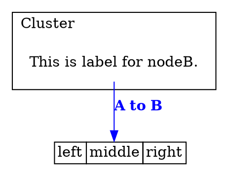

# @ts-graphviz/react

> It is part of the ts-graphviz library, which is split into modular packages to improve maintainability, flexibility, and ease of use.

Graphviz-dot Renderer using React.

## Installation

The module can then be installed using [npm](https://www.npmjs.com/):

[](https://nodei.co/npm/@ts-graphviz/react/)

```bash
# yarn
$ yarn add @ts-graphviz/react react react-dom
# or npm
$ npm install -S @ts-graphviz/react react react-dom
```

> Install [React and React DOM](https://github.com/facebook/react/) as peerDependencies at the same time.

## Example

```ts
import { Digraph, Node, Subgraph, Edge, renderToDot } from '@ts-graphviz/react';

const Example = () => (
  <Digraph
    rankdir="TB"
    edge={{
      color: 'blue',
      fontcolor: 'blue',
    }}
    node={{
      shape: 'none',
    }}
  >
    <Node
      id="nodeA"
      shape="none"
      label={
        <dot:table border="0" cellborder="1" cellspacing="0">
          <dot:tr>
            <dot:td>left</dot:td>
            <dot:td port="m">middle</dot:td>
            <dot:td port="r">right</dot:td>
          </dot:tr>
        </dot:table>
      }
    />

    <Subgraph id="cluster" label="Cluster" labeljust="l">
      <Node id="nodeB" label="This is label for nodeB." />
    </Subgraph>
    <Edge targets={['nodeB', 'nodeA:m']} comment="Edge from node A to B" label={<dot:b>A to B</dot:b>} />
  </Digraph>
);

const dot = renderToDot(<Example />);

console.log(dot);
```

### Output dot




## Contributing

Contributions to the ts-graphviz project are welcome.

Please refer to the main ts-graphviz repository for guidelines on how to contribute.

## License

This software is released under the MIT License.
