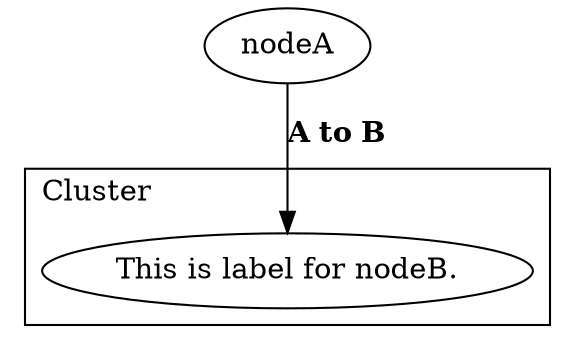
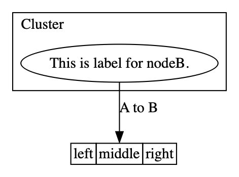

# @ts-graphviz/react

Graphviz-dot Renderer for React.

## Installation

The module can then be installed using [npm](https://www.npmjs.com/):

[](https://nodei.co/npm/@ts-graphviz/react/)

```bash
# yarn
$ yarn add @ts-graphviz/react
# or npm
$ npm install @ts-graphviz/react
```

## Usage

### Example

#### Script

```tsx
import React, { FC } from 'react';
import { Digraph, Node, Subgraph, renderToDot, Edge } from '../src';

const Example: FC = () => (
  <Digraph dpi={150}>
    <Node id="nodeA" />

    <Subgraph id="cluster" label="Cluster" labeljust="l">
      <Node id="nodeB" label="This is label for nodeB." />
    </Subgraph>
    <Edge targets={['nodeA', 'nodeB']} comment="Edge from node A to B" label={<b>A to B</b>} />
  </Digraph>
);

const dot = renderToDot(<Example />);

console.log(dot);
```

#### Output dot





## See Also

Graphviz-dot Test and Integration

- [ts-graphviz](https://github.com/ts-graphviz/ts-graphviz)
  - Graphviz library for TypeScript.
- [jest-graphviz](https://github.com/ts-graphviz/jest-graphviz)
  - Jest matchers that supports graphviz integration.
- [setup-graphviz](https://github.com/kamiazya/setup-graphviz)
  - GitHub Action to set up Graphviz cross-platform(Linux, macOS, Windows).

## License

This software is released under the MIT License, see [LICENSE](./LICENSE).
